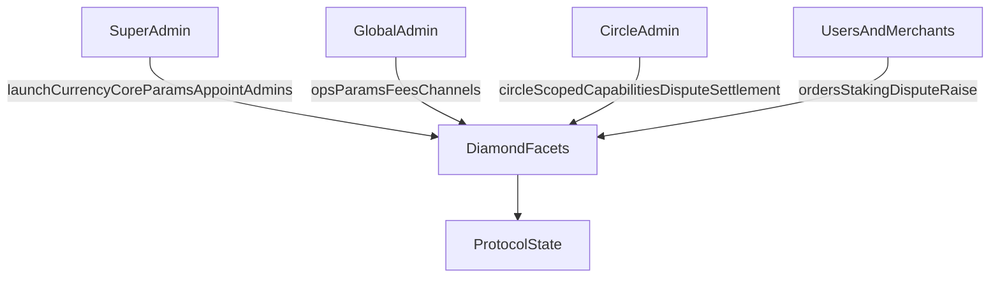
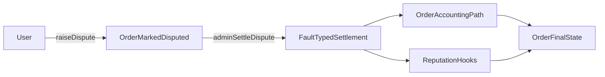
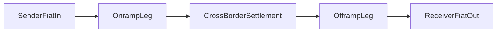
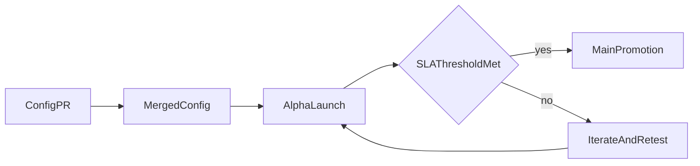

# For Builders

## Start Here

This page covers what builders need to integrate with, extend, or contribute to the P2P Protocol. It includes the protocol's technical governance model, contract architecture, and the highest-priority product expansion tracks.

**Quick links to key sections.**

- [Roles and permissions](/for-builders/roles-and-permissions)
- [Protocol parameters](/for-builders/protocol-parameters)
- [Disputes](/for-builders/disputes)
- [Reputation](/for-builders/reputation)
- [Contract references](/for-builders/contract-references)
- [Remittance expansion](/for-builders/fiat-to-fiat-remittance)
- [Currency expansion](/for-builders/global-currency-expansion)
- [SDK](/for-builders/sdk)
- [P2PKit Integration](/for-builders/p2pkit-integration)
- [FAQ](/for-builders/faq)

Also see [`/whitepaper`](/whitepaper/abstract) for protocol design and [`/for-token-holders`](/for-token-holders/start-here) for token governance and economics.

---

## Roles and Permissions

The protocol uses capability-based access control (RBAC), enforced through `CapabilityFacet` and `LibCapability`.

- **Super admin** launches currencies, sets core risk/limit parameters, manages critical protocol configuration, and appoints global admins.

- **Global admin** holds permissions across all circles, covering operational parameters such as spread, merchant fee percentages, and merchant/payment-channel actions.

- **Circle admin** grants and revokes circle-scoped capabilities within its own circle (super admins may also do so), gating actions such as settling disputes for orders in that circle.

- **Merchants and users** drive the order lifecycle, staking and registration flows, and dispute initiation according to contract rules.



---

## Protocol Parameters

Protocol behavior is heavily parameterized rather than hardcoded because markets differ. A spread that works for INR/USDC on UPI rails would be wrong for BRL/USDC on PIX. Parameterization lets the protocol adapt per-currency without redeploying contracts.

- **Pricing and spread.** Base spread and price bump by currency, adjusted for local liquidity conditions.

- **Risk limits.** Min stake, volume caps, RP-per-USDC limits, and max tx limits. These gate how much risk the protocol takes per merchant and per user.

- **Fee controls.** Merchant fee percentage and small-order fixed fees, tuned to make micro-transactions viable without subsidizing them.

- **Operational controls.** Currency and payment-channel activation lifecycles.

---

## Disputes

A user raises a dispute for an order if timing and state conditions of the order are met. The order is marked disputed and the merchant dispute state is updated. A holder of the dispute-settle capability for the order's circle then settles with a fault type (`USER`, `MERCHANT`, or `BANK`). Settlement triggers order and accounting paths, and [RP](/for-builders/reputation) (Reputation Points) is updated via hooks.

- Dispute windows differ by order type.
- A dispute cannot be raised twice.
- Settlement requires admin authorization.



*Jury-based escalation tiers (T1 resolver, T2 jury, T3 token-governance) and SLA-based auto-escalation are planned for a future release.*

---

## Reputation

Reputation Points (RP) control who can do what on the protocol. RP directly governs transaction limits, vote eligibility, and reward eligibility, and gates juror eligibility and proposal authoring. Dispute losses do not decide settlement. They impose RP penalties after a capability holder settles the dispute.

- Volume-driven RP growth rewards consistent participation.
- Dispute losses impose RP penalties that reduce future capacity.
- Verification signals (Aadhaar, social, passport) gate reward claims without requiring raw PII on-chain.

When token governance activates, RP and token voting become complementary. Tokens govern rules and reputation governs access.

---

## Contract References

- `facets/CountryFacet.sol` (currency and payment-channel config governance)
- `facets/P2pConfigFacet.sol` (pricing, spread, admin configuration)
- `facets/OrderProcessorFacet.sol` (disputes, limits, thresholds)
- `facets/MerchantRegistryFacet.sol` and `facets/MerchantOnboardFacet.sol` (merchant controls, fees, stake/unstake)
- `facets/OrderFlowFacet.sol` and `facets/OrderFlowHelper.sol` (order lifecycle, matching, settlement)
- `ReputationManager.sol` (standalone UUPS contract, separate from the Diamond, with RP hooks and reward/verification gating)
- `storages/MerchantRegistryStorage.sol`, `storages/CountryStorage.sol`, `storages/OrderProcessorStorage.sol`
- `libraries/MerchantRegistryLib.sol`

---

## Fiat-to-Fiat Remittance

The protocol already settles fiat-to-stablecoin and stablecoin-to-fiat independently. Remittance chains these two legs together atomically. The sender pays fiat in Country A, the receiver gets fiat in Country B, and the stablecoin hop in the middle is invisible to both.



Onramp, offramp, dispute, and matching rails all exist. The key insight is that remittance is purely a composition problem built from existing primitives. No new trust assumptions are needed.

**What's new for builders.**

- A linked order type that atomically connects onramp and offramp legs
- An escrow contract holding stablecoin between legs (failure on one side refunds the other)
- A receiver claim flow for recipients who don't already have accounts
- Cross-currency quote display and transparent fee breakdown

---

## Global Currency Expansion

Adding a new country today requires manual coordination with no standard process. Local knowledge is siloed. The expansion framework solves this by making country configs open-source and promotion criteria transparent.

- Open-source country YAML configs capturing local payment-rail knowledge
- Alpha environment where new currencies launch with explicit "no SLA guaranteed" framing
- Public health metrics (settlement rate, dispute rate, volume) that gate promotion to the main app



The bottleneck for geographic expansion is local knowledge. Open-source configs let anyone with local expertise propose a new currency. Public SLA gates ensure quality without requiring HQ to manually evaluate every market.

---

## Rollout Sequence

**Phase A.** Ship config standards, alpha lifecycle, and operational dashboards.

**Phase B.** Launch single high-priority remittance corridor with linked-order + escrow path.

**Phase C.** Expand corridors and currencies using measured SLA gates. Improve receiver claim UX and automation layers.

---

## SDK

<a class="button button--primary" href="https://discord.com/channels/1443615331783545004/1496425860008509571" target="_blank" style={{ display: 'inline-block', marginBottom: '16px' }}>Get SDK Support on Discord</a>

The easiest way to integrate P2P Protocol into your application is via the TypeScript SDK (`@p2pdotme/sdk`). It provides pre-built modules for orders, user profiles, pricing, currency config, ZK-KYC, fraud detection, and QR parsing, plus an optional React provider and hooks.

**Framework-agnostic.** The core is pure TypeScript, with optional React hooks.
**Wallet-agnostic.** Bring your own viem client.
**No exceptions.** All methods return `Result` / `ResultAsync` types.
**Modular.** Import only what you need.

Installation:
```bash
npm install @p2pdotme/sdk
```

Full source: https://github.com/p2pdotme/p2pdotme-sdk

### Environment Setup

#### Networks

The SDK supports **Base** (mainnet and testnet). Choose one:

| Network | Chain ID | Use Case |
|---------|----------|----------|
| **Base Mainnet** | 8453 | Production (real money) |
| **Base Sepolia** | 84532 | Development & testing |

#### Contract Addresses

You need three addresses for your network:

| Variable | Purpose |
|----------|---------|
| `DIAMOND_ADDRESS` | P2P.me protocol contract |
| `USDC_ADDRESS` | USDC token contract |
| `SUBGRAPH_URL` | GraphQL endpoint for order queries |

#### Base Sepolia (Testnet)

```env
REACT_APP_DIAMOND_ADDRESS=0xce868398FDaDcA368EAc203222874D6888532aE2
REACT_APP_USDC_ADDRESS=0xDABa329Ed949f28F64019f22c33c3B253B2Ded60
REACT_APP_SUBGRAPH_URL=https://api.studio.thegraph.com/query/110312/indexer-one/version/latest
```

#### Base Mainnet (Production)

```env
REACT_APP_DIAMOND_ADDRESS=0x4cad6eC90e65baBec9335cAd728DDC610c316368
REACT_APP_USDC_ADDRESS=0x833589fCD6eDb6E08f4c7C32D4f71b54bdA02913
REACT_APP_SUBGRAPH_URL=<deploy-your-own>
```

**For mainnet subgraph**: Deploy your own using the [P2P.me Subgraph repository](https://github.com/p2pdotme/subgraph).

#### RPC URLs

You need an RPC endpoint. Options:

**Public (free, rate-limited):**
```env
# Base Mainnet
REACT_APP_RPC_URL=https://mainnet.base.org

# Base Sepolia Testnet
REACT_APP_RPC_URL=https://sepolia.base.org
```

**Recommended (commercial, faster, more reliable):**
- [Alchemy](https://www.alchemy.com/), free tier available
- [Infura](https://www.infura.io/), free tier available
- [QuickNode](https://www.quicknode.com/), free tier available

#### Setup `.env.local` File

Create a `.env.local` in your project root. Copy the values from above based on your network:

**For Base Sepolia Testnet:**
```env
# Network
REACT_APP_RPC_URL=https://sepolia.base.org
REACT_APP_CHAIN_ID=84532

# Contract Addresses
REACT_APP_DIAMOND_ADDRESS=0xce868398FDaDcA368EAc203222874D6888532aE2
REACT_APP_USDC_ADDRESS=0xDABa329Ed949f28F64019f22c33c3B253B2Ded60
REACT_APP_SUBGRAPH_URL=https://api.studio.thegraph.com/query/110312/indexer-one/version/latest

# Your Account (for testing; development only!)
REACT_APP_PRIVATE_KEY=<your-private-key-here>
```

**For Base Mainnet (Production):**
```env
# Network
REACT_APP_RPC_URL=https://mainnet.base.org
REACT_APP_CHAIN_ID=8453

# Contract Addresses
REACT_APP_DIAMOND_ADDRESS=0x4cad6eC90e65baBec9335cAd728DDC610c316368
REACT_APP_USDC_ADDRESS=0x833589fCD6eDb6E08f4c7C32D4f71b54bdA02913
REACT_APP_SUBGRAPH_URL=<your-deployed-subgraph-url>
```

Load in your code:

```ts
const RPC_URL = import.meta.env.REACT_APP_RPC_URL;
const DIAMOND_ADDRESS = import.meta.env.REACT_APP_DIAMOND_ADDRESS;
const USDC_ADDRESS = import.meta.env.REACT_APP_USDC_ADDRESS;
const SUBGRAPH_URL = import.meta.env.REACT_APP_SUBGRAPH_URL;
```

#### Getting Testnet Funds

To test SELL/PAY orders on Base Sepolia, you need ETH + USDC:

- [Faucet.circle.com](https://faucet.circle.com/), gives both ETH + testnet USDC (recommended)
- [SepoliaFaucet.com](https://sepoliafaucet.com/), ETH only

### Setup

Install the SDK:
```bash
npm install @p2pdotme/sdk viem
```

You need:
- **publicClient**: viem `PublicClient` for reads
- **walletClient**: viem `WalletClient` for writes
- **diamondAddress**: P2P Protocol contract
- **usdcAddress**: USDC token address
- **subgraphUrl**: GraphQL endpoint

### React Example

```tsx
import { SdkProvider, useOrders, useProfile } from "@p2pdotme/sdk/react";
import { createPublicClient, createWalletClient, http } from "viem";
import { baseSepolia } from "viem/chains";

const publicClient = createPublicClient({
  chain: baseSepolia,
  transport: http(RPC_URL),
});

const walletClient = createWalletClient({
  chain: baseSepolia,
  transport: http(RPC_URL),
  account: YOUR_ACCOUNT,
});

function App() {
  return (
    <SdkProvider
      publicClient={publicClient}
      diamondAddress={DIAMOND_ADDRESS}
      usdcAddress={USDC_ADDRESS}
      subgraphUrl={SUBGRAPH_URL}
    >
      <OrderFlow />
    </SdkProvider>
  );
}

function OrderFlow() {
  const orders = useOrders();
  const profile = useProfile();

  async function buyUsdc() {
    const result = await orders.placeOrder.execute({
      walletClient,
      orderType: 0, // BUY
      currency: "INR",
      user: userAddress,
      recipientAddr: userAddress,
      amount: 10_000_000n, // 10 USDC (6 decimals)
      fiatAmount: 850_000_000n, // 850 INR (6 decimals)
      fiatAmountLimit: 0n,
    });

    result.match(
      ({ hash, meta }) => console.log("Order placed:", hash),
      (err) => console.error(`Error: ${err.code} - ${err.message}`),
    );
  }

  return <button onClick={buyUsdc}>Buy USDC</button>;
}
```

### Understanding Result Types

All SDK methods return `Result` types from neverthrow (never throw exceptions):

```ts
const result = await orders.placeOrder.execute(params);

// Always use .match() to handle success and error
result.match(
  (success) => {
    // Handle success
    console.log("Success:", success.hash);
  },
  (error) => {
    // Handle error
    console.error("Error:", error.code, error.message);
  }
);

// Or check with .isOk()
if (result.isOk()) {
  console.log("Hash:", result.value.hash);
} else {
  console.log("Error:", result.error.code);
}
```

---

### Orders

The `orders` module handles all order lifecycle operations.

### Order Types

| Type | Value | Description |
|------|-------|-------------|
| BUY | `0` | User receives USDC, sends fiat |
| SELL | `1` | User sends USDC, receives fiat |
| PAY | `2` | User sends USDC to wallet |

### Place BUY Order

```ts
const result = await orders.placeOrder.execute({
  walletClient,
  orderType: 0,
  currency: "INR",
  user: userAddress,
  recipientAddr: userAddress,
  amount: 10_000_000n,
  fiatAmount: 850_000_000n,
  fiatAmountLimit: 0n,
});
```

### Place SELL Order

SELL requires USDC approval first:

```ts
// 1. Approve
await orders.approveUsdc.execute({
  walletClient,
  amount: 10_000_000n,
});

// 2. Place order
const result = await orders.placeOrder.execute({
  walletClient,
  orderType: 1, // SELL
  currency: "INR",
  user: userAddress,
  recipientAddr: userAddress,
  amount: 10_000_000n,
  fiatAmount: 850_000_000n,
  fiatAmountLimit: 0n,
});

// 3. Set payment destination
await orders.setSellOrderUpi.execute({
  walletClient,
  orderId: result.value.meta.orderId,
  paymentAddress: "user@upi",
});
```

### Track Orders

```ts
// Get all user orders (returns Result type)
const result = await orders.getOrders({
  userAddress: userAddress,
  limit: 20,
  skip: 0,
});

result.match(
  (ordersList) => {
    console.log(`Found ${ordersList.length} orders`);
    ordersList.forEach((order) => {
      console.log(`Order ${order.orderId}: ${order.status}`);
    });
  },
  (err) => console.error(`Error: ${err.code}`),
);

// Get single order
const singleResult = await orders.getOrder({ orderId: 42n });
singleResult.match(
  (order) => console.log("Order:", order),
  (err) => console.error("Error:", err),
);

// Cancel order
const cancelResult = await orders.cancelOrder.execute({
  walletClient,
  orderId: "0x123...",
});

cancelResult.match(
  ({ hash }) => console.log("Cancelled! Hash:", hash),
  (err) => console.error("Error:", err.message),
);

// Raise dispute
const disputeResult = await orders.raiseDispute.execute({
  walletClient,
  orderId: "0x123...",
});

disputeResult.match(
  ({ hash }) => console.log("Dispute raised! Hash:", hash),
  (err) => console.error("Error:", err.message),
);
```

### Get Fees

```ts
const result = await orders.getFeeConfig({ currency: "INR" });

result.match(
  (feeConfig) => {
    // FeeConfig fields are 6-decimal bigints
    console.log(feeConfig.smallOrderThreshold, feeConfig.smallOrderFixedFee);
  },
  (err) => console.error("Error:", err.code),
);
```

---

### Profile & Limits

Check user balances, USDC allowance, and trading limits.

### Check Balances

```ts
// USDC balance
const balanceResult = await profile.getUsdcBalance({ address: userAddr });
if (balanceResult.isErr()) throw balanceResult.error;
const usdcBalance = balanceResult.value; // bigint

// USDC allowance (before SELL/PAY)
const allowance = await profile.getUsdcAllowance({
  owner: userAddress,
});

// getBalances likewise returns a Result:
const balancesResult = await profile.getBalances({ address: userAddress, currency: "INR" });
balancesResult.match(
  (b) => console.log(b.usdc, b.fiat),
  (err) => console.error(err.code),
);
```

### Check Limits

```ts
const result = await profile.getTxLimits({
  address: userAddress,
  currency: "INR",
});

result.match(
  (limits) => {
    // limits has: buyLimit, sellLimit
    console.log("Buy Limit:", limits.buyLimit);
    console.log("Sell Limit:", limits.sellLimit);
  },
  (err) => console.error("Error:", err.code),
);
```

Limits depend on reputation, KYC level, and currency risk parameters.

### Pre-flight Checks

Before BUY:
```ts
const result = await profile.getTxLimits({
  address: userAddr,
  currency: "INR",
});

result.match(
  (limits) => {
    if (amount > limits.buyLimit) {
      console.log("Exceeds buy limit");
    } else {
      console.log("Amount OK");
    }
  },
  (err) => console.error("Error:", err.code),
);
```

Before SELL:
```ts
// Get USDC balance
const balanceResult = await profile.getUsdcBalance({ address: userAddr });
if (balanceResult.isErr()) throw balanceResult.error;
const usdcBalance = balanceResult.value; // bigint

// Get limits
const limitsResult = await profile.getTxLimits({
  address: userAddr,
  currency: "INR",
});

limitsResult.match(
  (limits) => {
    if (usdcBalance < amount) {
      console.log("Insufficient USDC");
    } else if (amount > limits.sellLimit) {
      console.log("Exceeds sell limit");
    } else {
      console.log("Can sell");
    }
  },
  (err) => console.error("Error:", err.code),
);
```

---

### Error Handling

Decode contract errors to user-friendly messages.

### Error Structure

```ts
const error = {
  code: "INSUFFICIENT_BALANCE",
  message: "User has insufficient USDC balance",
  cause: rawError, // underlying error
};
```

### Decode Contract Errors

```ts
import {
  parseContractError,
  getContractErrorMessage,
} from "@p2pdotme/sdk/orders";

orders.placeOrder.execute(params).match(
  ({ hash }) => console.log("Placed:", hash),
  (err) => {
    const code = parseContractError(err.cause);
    const message = getContractErrorMessage(code);
    showToast(message); // "Order amount exceeds limit"
  },
);
```

### Common Error Codes

| Code | Meaning | Action |
|------|---------|--------|
| `INVALID_INPUT` | Invalid parameters | Check your inputs |
| `VALIDATION_ERROR` | Validation failed | Fix the data format |
| `NETWORK_ERROR` | RPC/subgraph error | Retry with backoff |
| `INSUFFICIENT_ALLOWANCE` | Need USDC approval | Call `approveUsdc.execute()` |

### Error Handling Patterns

Graceful degradation:
```ts
const result = await orders.placeOrder.execute(params);

result.match(
  (success) => {
    return { ok: true, hash: success.hash };
  },
  (error) => {
    console.error(`Error [${error.code}]: ${error.message}`);
    return { ok: false, message: error.message };
  },
);
```

Retry with backoff:
```ts
async function retryOrder(params, maxRetries = 3) {
  for (let i = 0; i < maxRetries; i++) {
    const result = await orders.placeOrder.execute(params);

    if (result.isOk()) {
      return result.value;
    }

    const { code } = result.error;

    // Only retry on network errors
    if (code === "NETWORK_ERROR") {
      await new Promise(r => setTimeout(r, 1000 * Math.pow(2, i)));
      continue;
    }

    // Don't retry validation errors
    throw result.error;
  }
}
```

---

### Advanced Patterns

Use `prepare`/`execute` separation, relay identity, and custom storage.

### Prepare vs Execute

`prepare()` returns raw transaction without signing:
```ts
const result = await orders.placeOrder.prepare(params);
// Returns: { to, data, value, meta }
// Send via relayer, multisig, or custom signer
```

`execute()` signs and sends with viem:
```ts
const result = await orders.placeOrder.execute({
  walletClient,
  ...params
});
```

### Use Cases

**Gasless relaying:**
```ts
const tx = await orders.placeOrder.prepare(params);
await relayerApi.send(tx.value);
```

**Multi-sig:**
```ts
const tx = await orders.placeOrder.prepare(params);
await multiSigWallet.queue(tx.value);
```

**Server-side signing:**
```ts
const tx = await orders.placeOrder.prepare(params);
const signed = await serverSignAndSend(tx.value);
```

### Relay Identity

SDK uses a keypair for sender anonymity. Default is in-memory (lost on refresh).

Persist to localStorage:
```tsx
import { createLocalStorageRelayStore } from "@p2pdotme/sdk/orders";

<SdkProvider
  orders={{
    relayIdentityStore: createLocalStorageRelayStore({ key: "relay" })
  }}
/>
```

Custom storage:
```tsx
const store = {
  get: async () => db.getRelayIdentity(),
  set: async (id) => db.saveRelayIdentity(id),
};

<SdkProvider orders={{ relayIdentityStore: store }} />
```

### Standalone (No React)

Use factories directly:
```ts
import { createOrders } from "@p2pdotme/sdk/orders";
import { createProfile } from "@p2pdotme/sdk/profile";
import { createPublicClient, http } from "viem";
import { baseSepolia } from "viem/chains";

const publicClient = createPublicClient({
  chain: baseSepolia,
  transport: http("https://sepolia.base.org"),
});

const orders = createOrders({
  publicClient,
  diamondAddress: "0xce868398FDaDcA368EAc203222874D6888532aE2",
  usdcAddress: "0xDABa329Ed949f28F64019f22c33c3B253B2Ded60",
  subgraphUrl: "https://api.studio.thegraph.com/query/110312/indexer-one/version/latest",
});

const profile = createProfile({
  publicClient,
  diamondAddress: "0xce868398FDaDcA368EAc203222874D6888532aE2",
  usdcAddress: "0xDABa329Ed949f28F64019f22c33c3B253B2Ded60",
});

// Use them
const orderResult = await orders.getOrder({ orderId: "0x123..." });
orderResult.match(
  (order) => console.log("Order:", order),
  (err) => console.error("Error:", err),
);

const balanceResult = await profile.getUsdcBalance({ address: "0x..." });
if (balanceResult.isErr()) throw balanceResult.error;
console.log("USDC:", balanceResult.value); // bigint
```

---

### Examples

Complete workflows for common patterns.

### Buy Flow

```ts
async function buyUsdc(userAddr, currency, fiatAmount) {
  const limitsResult = await profile.getTxLimits({ address: userAddr, currency });
  if (limitsResult.isErr()) throw limitsResult.error;
  if (fiatAmount > limitsResult.value.buyLimit) throw new Error("Exceeds limit");

  const priceClient = createPrices({ publicClient, diamondAddress });
  const priceResult = await priceClient.getPriceConfig({ currency });
  if (priceResult.isErr()) throw priceResult.error;
  const usdcAmount = (fiatAmount * 1_000_000n) / priceResult.value.buyPrice;

  return await orders.placeOrder.execute({
    walletClient,
    orderType: 0,
    currency,
    user: userAddr,
    recipientAddr: userAddr,
    amount: usdcAmount,
    fiatAmount,
    fiatAmountLimit: 0n,
  });
}
```

### Sell Flow

```ts
async function sellUsdc(userAddr, currency, usdcAmount) {
  const balanceResult = await profile.getUsdcBalance({ address: userAddr });
  if (balanceResult.isErr()) throw balanceResult.error;
  if (balanceResult.value < usdcAmount) throw new Error("Insufficient USDC");

  const allowance = await profile.getUsdcAllowance({ owner: userAddr });
  if (allowance < usdcAmount) {
    await orders.approveUsdc.execute({ walletClient, amount: usdcAmount });
  }

  const priceClient = createPrices({ publicClient, diamondAddress });
  const priceResult = await priceClient.getPriceConfig({ currency });
  if (priceResult.isErr()) throw priceResult.error;
  const fiatAmount = (usdcAmount * priceResult.value.sellPrice) / 1_000_000n;

  const placed = await orders.placeOrder.execute({
    walletClient,
    orderType: 1,
    currency,
    user: userAddr,
    recipientAddr: userAddr,
    amount: usdcAmount,
    fiatAmount,
    fiatAmountLimit: 0n,
  });

  if (!placed.isOk()) return placed;

  return await orders.setSellOrderUpi.execute({
    walletClient,
    orderId: placed.value.meta.orderId,
    paymentAddress: "user@upi",
  });
}
```

### Monitor Order Status

```ts
function useOrderStatus(orderId) {
  const [order, setOrder] = useState(null);
  const orders = useOrders();

  useEffect(() => {
    let poll;
    const fn = async () => {
      const result = await orders.getOrder({ orderId });
      if (result.isOk()) setOrder(result.value);
    };

    fn();
    poll = setInterval(fn, 3000);
    return () => clearInterval(poll);
  }, [orderId, orders]);

  return order;
}
```

## P2PKit Integration

P2PKit enables developers to accept local payments and settle in USDC, reaching users in markets where traditional card payments don't work.

### Overview

P2PKit orchestrates local payments globally, enabling your application to:

- **Accept local payments** - Users pay via QR codes, UPI, PIX, bank transfers, and other local methods
- **Settle in USDC** - Receive on-chain payments in USDC on Base, not in local bank accounts
- **Verify instantly** - On-chain payment verification without self-reporting risk
- **Expand globally** - Reach new markets without managing local payment infrastructure

### How It Works

#### 1. User Initiates Payment
Users scan a QR code or select their preferred payment method (UPI, PIX, bank transfer, etc.) in your application. No crypto knowledge or new app needed.

#### 2. Local Partner Collection
P2PKit instantly finds a verified partner in the customer's market who collects the payment locally.

#### 3. Payment Verification
Once the partner confirms receipt of funds, the transaction settles on-chain. All verification is cryptographic and verifiable.

#### 4. USDC Settlement
Your application receives USDC on Base, ready to spend, transfer, or hold. Settled in a single token across all markets.

### Key Features

- **Zero Custody Risk** - Non-custodial smart contracts handle all settlement
- **Instant Settlement** - USDC arrives on Base immediately after payment confirmation
- **Multi-Currency Support** - Accept payments in 25+ fiat currencies
- **Method Flexibility** - Support for Wise, Venmo, PIX, UPI, bank transfers, MercadoPago, and more
- **Global Reach** - Operate in emerging markets without local banking relationships

### Supported Payment Methods

| Method | Currencies |
|--------|-----------|
| **Wise** | USD, EUR, GBP, etc. |
| **Venmo** | USD |
| **PIX** | BRL |
| **UPI** | INR |
| **Bank Transfers** | Multiple |
| **MercadoPago** | BRL, ARS, MXN |
| **Revolut** | USD, EUR, GBP |
| **Zelle** | USD |
| **Monzo** | GBP |

### Integration Path

To integrate P2PKit with the P2P Protocol:

1. **Configure P2PKit** - Set up payment methods and settlement accounts
2. **Create Orders** - Generate P2PKit orders from your application
3. **Receive Settlement** - USDC arrives on Base for transaction processing
4. **Route to P2P** - Use P2P Protocol for on/off-ramp operations if needed

### API Reference

For complete integration details and SDKs, visit:

- **Official Documentation**: [p2pkit.com](https://p2pkit.com/)
- **SDK Packages**: `@zkp2p/offramp-sdk` and related packages available on npm

### Use Cases

- **Global Remittances** - Accept local payments, settle in USDC for on-chain transfer
- **Merchant Settlements** - Accept payments from any market, settle in a single stablecoin
- **Cross-Border Commerce** - Simplify multi-currency transactions
- **DeFi On-Ramps** - Connect local payment methods to on-chain liquidity

### Next Steps

- Review P2P Protocol integration points in [`/for-builders/sdk`](/for-builders/sdk)
- Explore protocol parameters in [`/for-builders/protocol-parameters`](/for-builders/protocol-parameters)
- Check contract references in [`/for-builders/contract-references`](/for-builders/contract-references)

## FAQ

### What chain are the contracts deployed on?

The protocol's smart contracts are live on Base (EVM). Solana deployment is planned as part of the multichain expansion. The $P2P token is an SPL token on Solana. See the [token and chain FAQ](/for-token-holders/faq) for details.

### Where are the contract ABIs?

Contract references are listed in the [Contract References](/for-builders/contract-references) section. The integration surface is already open source: the SDK ([`@p2pdotme/sdk`](https://github.com/p2pdotme/p2pdotme-sdk)), the React widgets ([`@p2pdotme/widgets`](https://github.com/p2pdotme/widgets)), and the B2B integrator contracts and interfaces ([`payment-integrators`](https://github.com/p2pdotme/payment-integrators)). The core protocol Diamond contracts are pending audit and will be open-sourced thereafter.

### Can I add a new country or currency?

The currency expansion framework uses open-source YAML configs. Anyone with local payment-rail knowledge can propose a new currency via PR.

### How do disputes work at the contract level?

Users call `raiseDispute` on `OrderProcessorFacet`. Admins settle via `adminSettleDispute` with a fault type. Settlement triggers accounting and RP hooks. See [Disputes](/for-builders/disputes) for the full flow.

### What is the Diamond architecture?

The protocol uses EIP-2535 Diamond Standard. Functionality is split across facets that share storage, enabling modular upgrades without redeploying the full contract.

### How does RP integrate with order flow?

RP hooks are whitelisted in the `ReputationManager`. Order volume updates, dispute penalties, and verification-gated rewards all flow through these hooks. See [Reputation](/for-builders/reputation).

### Where does governance detail live for token holders?

Token-holder governance (voting model, quorum, progressive decentralization) is documented in [`/for-token-holders`](/for-token-holders/start-here).
