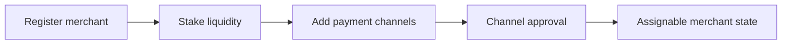
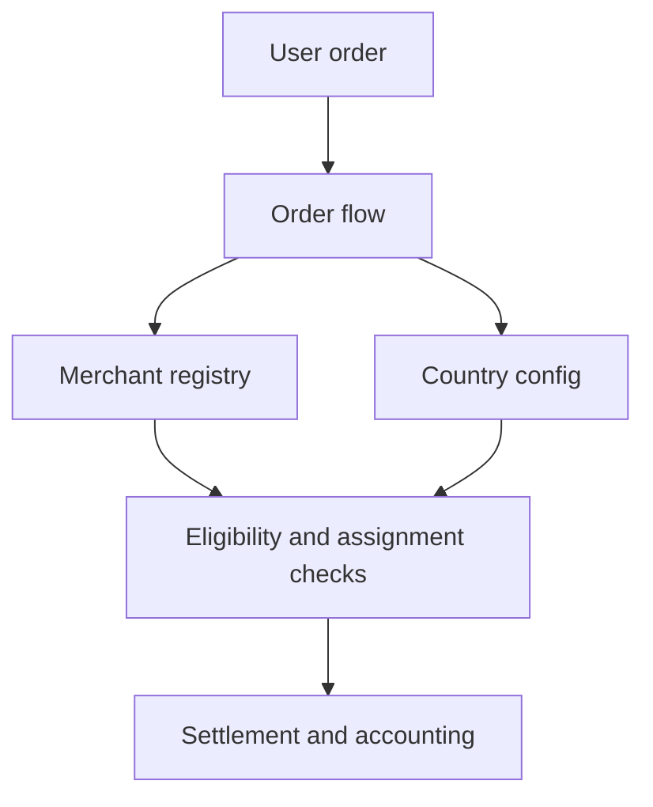
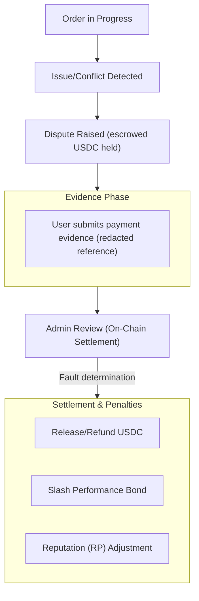

# For Merchants

## Start Here

This guide covers merchant operation on P2P Protocol, from registration and staking through order handling, disputes, and Circles of Trust.

- [Merchant readiness](/for-merchants/merchant-readiness)
- [Setup flow](/for-merchants/merchant-setup-flow)
- [Handling orders](/for-merchants/handling-orders)
- [Operational controls](/for-merchants/operational-controls)
- [Circles of Trust](/for-merchants/circles-of-trust)
- [Payment channels and country controls](/for-merchants/payment-channels-and-country-controls)
- [Order assignment](/for-merchants/order-assignment)
- [Disputes](/for-merchants/disputes)
- [Delegation and revenue sharing](/for-merchants/delegation-and-revenue-sharing)
- [Insurance](/for-merchants/insurance)
- [Risk and reliability practices](/for-merchants/risk-and-reliability-practices)
- [Troubleshooting](/for-merchants/troubleshooting)
- [FAQ](/for-merchants/faq)

Also see [`/for-users`](/for-users/start-here) to understand user-side expectations and [`/whitepaper`](/whitepaper/abstract) for protocol context.

---

## Merchant Readiness

Before operating, ensure you have the following.

- An account on a supported client or admin interface. A non-custodial smart-account wallet is provisioned in-app.
- Required settlement liquidity for supported currency operations.
- Active payment rails/accounts you can operationally maintain.

---

## Merchant Setup Flow

### Step 1 Register and Stake

1. Register as merchant for an active currency.
2. Stake required settlement liquidity.
3. Confirm your merchant profile and operational status.

### Step 2 Add Payment Channels

1. Add payment channels for your supported rails.
2. Wait for required approval states.
3. Keep approved channels active and up to date.

### Order Capacity and Account Rules

Your per-order buy capacity is derived from your Reputation Points and the currency you operate in, not from a fixed multiple of your stake. The relationship is set per currency. The values below are current defaults, and the live value is shown in-app.

| Currency | Capacity rate | Per-transaction cap | Yearly volume cap |
|----------|---------------|---------------------|-------------------|
| INR | 1 RP equals $1 USDC | $400 USDC | $20,000 USDC |
| BRL | 1 RP equals $2 USDC | $400 USDC | $20,000 USDC |
| IDR | 1 RP equals $2 USDC | $400 USDC | $20,000 USDC |
| ARS | 1 RP equals $1 USDC | $400 USDC | (set per currency) |

Reputation Points accrue through verification and through cumulative volume milestones at $1,000, $5,000, $20,000, and $50,000 USDC. Order count is also gated. The current defaults are 5 buy orders per day, 25 buy orders per month, and a daily sell allowance equal to ten times your per-transaction sell limit. The live values are shown in-app.

Account and payment-channel rules vary by country and are enforced in-app. Operate only from accounts in your own name. In some markets the general "add more payment channels" prompt does not apply, so follow the in-app guidance for your country.

---

## Handling Orders

### Accepting Orders

1. Monitor assigned orders.
2. Accept orders promptly.
3. Follow the settlement steps by order type.

### Completing Orders

- Confirm payment actions as required by the flow.
- Ensure finalization steps are completed in-app.
- Keep records/evidence for dispute scenarios.

---

## Operational Controls

As a merchant, you should routinely perform the following.

- Keep channels active only when you can service them.
- Maintain sufficient liquidity for expected order load.
- Monitor order states and ongoing-order constraints.
- Withdraw accrued fees via supported flow.
- Use unstake/request flows when reducing or exiting activity.

---
## Circles of Trust

A Circle of Trust is a community-backed collective of merchants operated by a Circle Admin. Each Circle functions as a semi-autonomous unit within the protocol, managing its own merchant network while adhering to shared on-chain protocol rules.

Circles organize merchants into accountable groups, enable community oversight through staking and delegation, and distribute risk through tiered insurance pools.

The merchant registry is the operational core that Circles wrap. All merchant operations are on-chain and role-gated.

*First-class Circle entities with dedicated lifecycle, Circle Admin roles with explicit stake requirements, and Circle-scoped merchant grouping are planned for a future release.*

---

## Payment Channels and Country Controls

Policy is governed at the currency/country layer.

- Supported currencies can be activated or deactivated.
- Payment-channel configs are created, updated, activated, and deactivated.
- Monthly volume controls and thresholds are enforced by config.
- Merchant minimum stake and fee percentages are set per currency.

This creates a jurisdiction-aware operating model.

---

## Order Assignment

Order assignment is constrained by merchant and payment-channel checks.

- Online/offline state
- Blacklist, dispute, and unstake-request status
- Ongoing-order capacity checks
- Payment-channel active/approved status
- Daily and monthly volume checks
- Fiat and stake-backed liquidity thresholds

Assignment is deterministic and on-chain. The checks are layered so that a single failing condition removes a merchant from the candidate pool without affecting others.

---

## Disputes

If a dispute is raised, follow these steps.

1. Review order context and timestamps.
2. Submit supporting evidence in-app.
3. Follow settlement updates and resulting order state transitions.

Disputes are settled on-chain by the order's Circle Admin (or a capability-holder authorized for that Circle), who assigns user or merchant fault. Dispute windows govern when a dispute can be raised.

The windows are enforced on-chain by order type. For a buy order, the user can raise a dispute from 15 minutes after the order was placed up to 24 hours after it was placed. A buy dispute additionally requires the order to be in a cancelled state with a recorded paid timestamp. For a sell or pay order, the window runs from 30 minutes after placement up to 7 days after placement. Attempts outside these bounds revert.

| Order type | Earliest a dispute can open | Latest a dispute can open |
|------------|-----------------------------|---------------------------|
| Buy | 15 minutes after placement | 24 hours after placement |
| Sell or pay | 30 minutes after placement | 7 days after placement |

*Jury-based escalation tiers and governance-vote finality for disputes are planned for a future release.*

---

## Delegation and Revenue Sharing

Delegators stake USDC into a Circle's delegation pool to back its merchants and earn a share of merchant rewards proportional to their delegated stake. Circle Admins separately stake $P2P to create and operate a Circle. Revenue is split in basis points configured per currency. The merchant and the Circle Admin each receive a base share of transaction volume. The merchant's share is then apportioned by the ratio of self-stake to delegated stake, and the delegated-stake portion is further divided between the merchant, the Circle Admin, and the delegation pool by configurable per-currency parameters.

This within-Circle distribution is separate from the protocol-level revenue split. At the protocol level, 20 percent of protocol revenue routes to the treasury and 80 percent to network operators (merchants, Circle Admins, delegators, and insurance). The split described here governs how the operator portion of a single order is shared inside a Circle, and it is set in basis points per currency. The values below are the current spec defaults for the delegated-stake portion, and the live value is shown in-app.

| Recipient | Default share of the delegated-stake portion |
|-----------|----------------------------------------------|
| Merchant | 60 percent |
| USDC delegators | 20 percent |
| Circle Admin Insurance Pool (CAIP) | 10 percent |
| Circle Admin | 10 percent |

Reward distribution to delegators is snapshot-based. The pool tracks rewards per token and pays each delegator in proportion to their share when rewards are notified. Delegators claim accrued rewards in-app and exit through a request and a cooldown.

*The full delegation UI and Circle-level reward routing mechanics are planned for a future release.*

---

## Insurance

Each Circle includes insurance pools to protect participants.

**CAIP (Circle Admin Insurance Pool).** First-line coverage funded by a percentage of Circle volume plus slashed stakes.

**CALR (Circle Admin Loss Reserve).** A portion of admin earnings locked as a rolling buffer.

**PIP (Pool Insurance Pool).** Protocol-wide backstop for systemic failures or depleted lower-tier pools.

The pools and their on-chain funding are in place. When the claim workflow is live, claims draw first from the per-Circle CAIP, then from the responsible admin's CALR, with PIP as the protocol-wide backstop that refills depleted pools.

The full claim workflow, raise, approve, and settle, is being finalized and is not yet live.

---

## Risk and Reliability Practices

- Respond quickly to assigned orders.
- Keep channel metadata and payment details accurate.
- Avoid operating channels when unavailable.
- Preserve evidence trails for contested payments.
- Treat cancellations and disputes as quality signals to improve operations.

### PIX Recurring-Payment Pattern

One pattern to watch for on the PIX rail is a payment configured to repeat automatically on future dates, sometimes labelled recurring PIX, automatic PIX, or an annual or monthly plan. Completing such an order can authorize charges beyond the single transaction in front of you. Do not complete the order. Cancel it and report it with the order ID.

If you believe you authorized a repeating payment in error, cancel the recurrence in your banking app and report it with the order ID. Fraud detection on the protocol runs off-chain through the SEON Fraud API across registration, verification, and transaction events. The on-chain Diamond enforces dispute timing, Reputation Point penalties, and blacklist gates. It does not score transactions, so your judgement at the point of payment is the first line of defence.

---

## Troubleshooting

### Not getting assigned orders

- Confirm you are online and channels are approved/active.
- Confirm operational availability and liquidity sufficiency.

### Orders frequently cancelled

- Review response speed and settlement completion discipline.
- Ensure payment channel details and balances are current.

### Unable to complete payout or settlement path

- Re-check channel readiness and app prompts.
- Escalate using supported admin/ops process if needed.

### Fee withdrawal not available

- Confirm you have accrued withdrawable fees and no blocking state.
- Retry through supported merchant operations interface.

---

## Circle Admin Operations

A Circle Admin operates a community-backed group of merchants under one currency and one configuration. The role is to run a local operating unit. You recruit merchants and approve their payment channels, you settle disputes inside your Circle, you provide operational support, and you monitor merchant performance. Each wallet can operate one Circle, recorded on-chain by the admin address.

### What the role is not

Several things are explicitly outside the Circle Admin's responsibility, because the protocol handles them.

- Payment processing and settlement run automatically on-chain.
- No third-party funds are held by the admin. Balances are escrowed and settled by the Diamond.
- User KYC is handled by the protocol's verification layer, not by the admin.

### Creating a Circle

Circle creation is permissionless. Any wallet that meets the per-currency minimum $P2P stake can create one, provided it does not already operate a Circle and the chosen name is globally unique. The currency must already be registered on the protocol.

1. Connect your wallet to the Circle Admin interface.
2. Configure the Circle name, the operating currency, a community URL, and the auto-approval setting for payment channels. Manual approval is the more conservative choice.
3. Stake $P2P to the protocol. The stake is recorded against your admin address and remains locked while the Circle operates.
4. Confirm the transaction. The Circle moves to an active state once your stake is in place.

The minimum admin stake is set per country. The current spec default is the equivalent of $250 USDC in $P2P. The on-chain minimum may be unset until a country is configured, so the live minimum shown in-app is authoritative. A Circle becomes inactive if the admin stake falls below the configured minimum. You can add stake at any time, and you can request to unstake down to the minimum through a request-and-cooldown flow.

### Cost and revenue mechanics

The cost to operate is the locked $P2P stake plus transaction gas. The stake is operational collateral, not a fee. It is returned through the unstake flow subject to the cooldown, and it can be slashed by a super admin in defined misconduct cases.

On the revenue side, a Circle earns a Circle commission expressed as a share of Circle volume. The current default is 0.25 percent of Circle volume, split between the Circle Admin and the community $P2P stakers by a configurable ratio. The live value is shown in-app. A portion of admin earnings is held back as a locked rolling buffer (Circle Admin Loss Reserve) before it becomes claimable. The split between the Circle Admin and community $P2P stakers and the locked portion are configurable per currency.

### Access control and delegation of duties

A Circle Admin holds the default permissions for the Circle and can grant specific permissions to helpers through capability-based access control, scoped per Circle. Common grants are approving or rejecting merchant payment channels, settling disputes, and blacklisting merchants. Grants are revocable at any time, and they are revoked automatically when the admin role transfers. Granting a permission does not transfer accountability. The Circle Admin remains responsible for decisions made under granted permissions.

### Circle status and rejection

A Circle is active while the admin stake is at or above the minimum and the Circle has not been rejected. Merchant-fault dispute settlements increment a per-Circle dispute counter. When the counter crosses the configured threshold for the currency, the Circle auto-transitions to a rejected state and new merchant onboarding is blocked until a super admin resets the counter. There is no automatic time-based decay of the counter.

---

## FAQ

### Do I need to know internal scoring criteria?

No. Operate based on app-visible status, liquidity requirements, and channel approval states.

### Can I run multiple payment channels?

Yes, each subject to its own approval and volume limits.

### What happens if a user disputes my order?

Submit evidence promptly. The dispute resolves on-chain based on fault determination and the evidence provided.

### Can I pause order assignments?

Yes. Toggle online/offline status or deactivate channels when you can't service orders.

### What is a Circle of Trust and how does it affect me?

A Circle is a community-backed group of merchants. Circle Admins oversee operations, and community members can delegate USDC into your Circle's pool to earn a share of merchant rewards. As a merchant, your primary interaction is through the merchant registry and payment channels that Circles wrap.

### How do I earn revenue?

Merchants earn a share of transaction volume through the protocol's fee distribution model. You can withdraw accrued fees through the supported merchant operations flow. See [`/for-token-holders`](/for-token-holders/start-here) for the full fee distribution breakdown.

### Where are the exact numeric thresholds?

Thresholds visible in your deployment/client are operational. Internal scoring criteria are not publicly documented.
