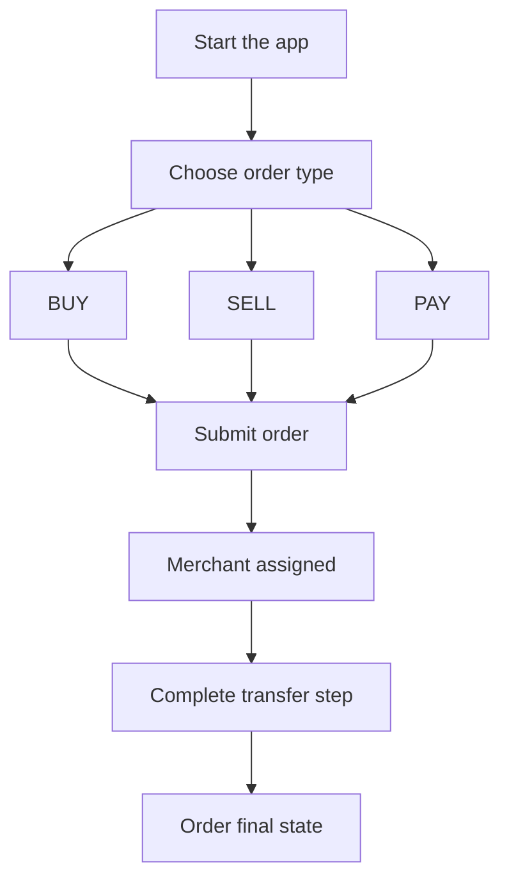

# For Users

## Start Here

This guide covers everything you need to buy, sell, or pay with stablecoins using P2P Protocol.

Jump to a section:

- [Before you start](/for-users/before-you-start)
- [Order types](/for-users/order-types)
- [How to place an order](/for-users/how-to-place-an-order)
- [What to do by order type](/for-users/what-to-do-by-order-type)
- [Understanding order states](/for-users/understanding-order-states)
- [Disputes and evidence](/for-users/disputes-and-evidence)
- [Troubleshooting](/for-users/troubleshooting)
- [FAQ](/for-users/faq)

Also see [`/for-merchants`](/for-merchants/start-here) to understand counterparty actions and [`/whitepaper`](/whitepaper/abstract) for protocol context.

---

## Before You Start

**What you need.**

- An account on a P2P Protocol client app. A wallet is provided in-app during sign-in, so you do not need to bring your own.
- Access to supported payment rails in your region.
- Stablecoin balance for `SELL`/`PAY` flows.

**Basic safety checks.**

- Confirm you are on the official app domain before signing in.
- Verify order details (amount, currency, recipient) before submission.
- Do not share your login credentials or account recovery information.

---

## Order Types

There are 3 types of orders supported, namely:

- **BUY**: you pay fiat and receive stablecoin.
- **SELL**: you transfer stablecoin and receive fiat.
- **PAY**: you transfer stablecoin to settle a payment over supported fiat rails.

---

## How to Place an Order

1. Open the app and select `BUY`, `SELL`, or `PAY`.
2. Enter amount and required recipient/payment details.
3. Submit order and wait for merchant assignment.
4. Follow app prompts for transfer and confirmation.

---

## What to Do by Order Type

### BUY (Fiat to Stablecoin)

1. Place `BUY` order.
2. Receive assigned merchant payment details.
3. Send fiat using the instructed rail.
4. Complete required in-app confirmation.
5. Track order until completion.

### SELL / PAY (Stablecoin to Fiat or Payment Rail)

1. Place a `SELL` or `PAY` order.
2. Approve and transfer the stablecoin when prompted.
3. Wait for the counterparty to settle to your destination.
4. Confirm completion in-app once the counterparty has settled, then track the order to the `COMPLETED` state.

---

## Understanding Order States

| Status | Meaning |
|--------|---------|
| `PLACED` | Order created and pending active handling |
| `ACCEPTED` | A merchant accepted the order |
| `PAID` | You marked that you sent the fiat payment (BUY orders). The merchant then releases the stablecoin. |
| `COMPLETED` | Settlement path finished successfully |
| `CANCELLED` | Order was cancelled or expired |

If your order remains in a state longer than expected, use in-app support/escalation and check dispute eligibility.

---

## Disputes and Evidence

If the counterparty does not fulfill their obligation, you can raise a dispute on-chain. Eligibility depends on the order type and status.

- BUY orders: a dispute can be raised between 15 minutes and 24 hours after the order was placed, and only if you marked the order as paid before it was cancelled.
- SELL and PAY orders: a dispute can be raised between 30 minutes and 7 days after the order was placed, and only after the order reaches the COMPLETED state.

To raise a dispute:

1. Open the order and select the dispute option once the window is open.
2. Submit the requested evidence in-app. The protocol records a redacted reference to your payment as on-chain evidence.
3. Monitor the dispute status until it is settled.

A dispute can be raised only once per order.

Disputes are settled on-chain by an authorized admin who assigns fault. If the merchant is at fault, the order completes and the stablecoin settles to the recipient. If you are found at fault, the order stays cancelled and a reputation penalty applies, which an admin can reverse if you later show the claim was honest. Jury-based escalation tiers are planned for a future release.

---

## Troubleshooting

### Order was cancelled unexpectedly

- Check whether the order expired or a transfer step failed.
- Recreate order with correct details and complete steps promptly.

### Merchant not responding

- Wait for the protocol reassignment/timeout path where applicable.
- If conditions are met, raise a dispute with evidence.

### Transfer failed

- Confirm token approval/balance for `SELL`/`PAY`.
- Confirm rail details and payment confirmation steps for `BUY`.

---

## Circles of Trust

A Circle is a community-backed merchant group run by one Circle Admin under shared on-chain protocol rules. Each Circle holds its own currency, merchant set, fiat balance, and USDC liquidity. Circles exist so that the people who know local sellers can operate and support them, instead of one central desk handling every market. As a buyer, you trade with merchants inside a Circle.

You do not manually pick a Circle today. The protocol assigns an eligible merchant to your order based on real-time factors such as liquidity, channel status, and availability. Manual Circle selection and reputation-based sorting are planned for a future release. When the app shows Circle information alongside an order, it reflects on-chain state such as merchant stake and order history.

A Circle gives a buyer two concrete protections. First, merchants stake USDC and Circle Admins stake $P2P to operate, so there is collateral behind the people you trade with. Second, each Circle is backed by insurance reserves. There are three pools. The Circle Admin Insurance Pool (CAIP) is a per-Circle reserve funded from a share of order fees. The Circle Admin Loss Reserve (CALR) is a per-admin buffer funded from a portion of admin rewards. The Pool Insurance Pool (PIP) is a protocol-wide backstop. The pools and their funding are in place on-chain, and settlement work and reward accounting run on-chain and are verifiable.

The full insurance claim workflow is being finalized and is not yet live. When it ships, claims will be raised by merchants against the pools when USDC is lost despite proper merchant behavior, and each claim will be reviewed before settlement rather than refunded automatically. As a buyer, your recourse for a bad trade is the order dispute path, not the insurance-claim path.

Your side of a dispute is covered in full under [Disputes and Evidence](/for-users/disputes-and-evidence). In short, a dispute can be raised once per order, and an authorized admin settles it on-chain by assigning fault. If the merchant is at fault, the order completes and the stablecoin settles to the recipient. Jury-based and governance-driven escalation tiers are planned for a future release.

---

## Verification and Limits

P2P Protocol verifies identity with zero-knowledge proofs. Verification proves you meet the eligibility criteria without revealing who you are. No raw personal data is stored on-chain. The protocol keeps only commitments and verdicts.

Verification uses several zero-knowledge rails, and you need to clear at least one to place orders.

ZK Passport reads your passport over NFC. You scan the photo page of your passport, then scan the NFC chip on the back cover. The proof confirms that you hold a valid passport and that you meet the age requirement. Your name, passport number, photo, and other personal data are not shared.

In India, Anon Aadhaar verifies that you hold a valid Aadhaar record. The proof confirms the record without disclosing your Aadhaar number, and only the resulting verdict reaches the chain.

Reclaim Protocol verifies a social account privately over zkTLS. It checks signals such as account age and activity against eligibility criteria, without giving the protocol access to your account content. If you see a message that your account does not meet the eligibility requirements, your account did not clear the minimum criteria for that platform. You can use ZK Passport verification instead.

Verification feeds your Reputation Points (RP), an on-chain score that gates how much you can transact. RP grows as you verify identity and as your completed volume reaches milestones. Cumulative completed volume at $1,000, $5,000, $20,000, and $50,000 each award an RP milestone. Cancelled orders do not count toward your limits.

Per-transaction limits scale with RP, using a per-currency ratio. The published defaults are 1 RP to $1 USDC for INR and ARS, and 1 RP to $2 USDC for BRL and IDR. Per-transaction limits are capped, with a published default cap of $400 per trade, and there is a published default minimum sell limit of $100 per trade. Before any ZK verification, the buy limit is $0 and selling is bounded by that minimum. Daily and monthly order counts also apply, with published defaults of 5 buy orders per day and 25 buy orders per month. These are current defaults. The live value that applies to your account is shown in-app.

---

## Security and Safety

Several protections sit behind every trade. Merchants stake USDC and Circle Admins stake $P2P, so there is collateral behind the operators you transact with. Each Circle is backed by collateral and insurance reserves. Every order and settlement is recorded on-chain, so the history is transparent and you can verify any operation. Identity is checked with zero-knowledge proofs at signup, and the protocol screens against sanctions lists and monitors transaction patterns. Order placement is gated on-chain by reputation, transaction limits, and blacklist state.

Good habits protect you further. Keep the conversation inside the app, where it is recorded. Do not move a negotiation off the platform. Keep your payment receipts. Confirm the order amount, currency, and recipient before you submit. If something goes wrong, open a dispute promptly, document the problem with screenshots, and describe it clearly.

Treat the following as warning signs.

- The other party asks to continue the conversation outside the app.
- The price is far below the market rate.
- You are pressured to close the trade quickly.
- You are asked for sensitive data beyond what the flow requires.

If you see these signs, slow down and use in-app support before sending anything.

---

## Verifying Transactions On-Chain

The protocol settles in USDC on Base, an EVM Layer 2. Every order and settlement is recorded on-chain, so you can confirm any transaction yourself using BaseScan, the public block explorer at [basescan.org](https://basescan.org). BaseScan lets you view the transactions for an address, check token balances, and see whether a transaction succeeded along with its details.

Find your address first. In the app, open My Account or Wallet and copy the address, which starts with `0x`.

To look up an address, paste it into the BaseScan search bar and press Enter. The address page lists the ETH balance, the ERC-20 tokens held, and the full transaction history, including token transfers and internal contract calls.

To look up a single transaction, you need its transaction hash, a unique identifier that looks like `0x` followed by 64 hexadecimal characters. You can copy the hash from your in-app transaction history or from any row on your BaseScan address page. Paste the hash into the BaseScan search bar and press Enter.

The transaction page shows the fields that matter for verification.

| Field | Meaning |
|-------|---------|
| Status | Success or Failed |
| Block | The block number where the transaction confirmed |
| Timestamp | The date and time of the transaction |
| From | The address that sent the transaction |
| To | The address or contract that received it |
| Transaction Fee | The gas cost paid |

When a transaction moves a token such as USDC, scroll to the token-transfer section to see the token, the amount, and the sending and receiving addresses. To confirm you are looking at the correct token, open the token and check its contract address against the official one. The canonical USDC contract on Base is `0x833589fCD6eDb6E08f4c7C32D4f71b54bdA02913`. Base uses chain ID 8453.

If a transaction does not appear, give it a few minutes to confirm and make sure you are searching on Base. If you sent funds and the recipient reports nothing arrived, look up the hash, confirm the status is Success, and check the To address and the token transfer. Keep the hashes for large transactions, since they help support and dispute tickets.

---

## Self-Custody and Fund Recovery

Your account is self-custodial. You control the keys, and the protocol does not custody your funds outside the transient escrow that an order uses while it settles. Settlement is in USDC on Base. The practical implication is that the protocol cannot reset a password or restore access for you, so protecting your access methods is your responsibility.

Protect your access before you need it. Add more than one login method in your wallet settings so the loss of any single method does not lock you out. Keep any backup material the app gives you in a safe place, and never share it with anyone. If you lose every access method, your funds can become permanently inaccessible.

The exact on-chain steps for a user to move funds out of the account independently of the app are not documented in our verified protocol architecture, so this guide does not publish a step-by-step external-recovery procedure. The smart-account model described in third-party community guides has not been confirmed against the protocol source of record. For any recovery question, contact support in-app before attempting an on-chain transaction with exported key material.

---

## FAQ

### Do I need to understand on-chain mechanics?

No, you are not forced to understand on-chain mechanics. The client app handles all contract interaction. Follow the status prompts to fulfill your action.

### Why wasn't my order matched instantly?

Merchant assignment depends on real-time eligibility factors, including liquidity, channel status, volume limits, and operational availability. If no merchant qualifies, the order waits and is cancelled when it times out.

### Can I appeal a dispute?

No. In the current release a dispute can be raised only once per order, and an authorised admin settles it on-chain by assigning fault. There is no separate appeal step. Jury-based and governance-driven escalation tiers are planned for a future release.

### Is my identity stored on-chain?

No raw PII(Personally Identifiable Information) is stored on-chain. The protocol uses ZK-KYC proofs for identity verification and stores only commitments and verdicts on-chain.

### How do I know what to do next?

Your order status (`PLACED`, `ACCEPTED`, `PAID`, `COMPLETED`, `CANCELLED`) tells you. Each status implies a specific next action. The app guides you through it.

### What kind of wallet do I use?

A wallet is provided in-app during sign-in, so you do not need to bring your own. The account is self-custodial, which means you control the keys and the protocol cannot recover access for you.

### Why does my balance look missing?

Your balance is held in your in-app account. Check it in-app first, and look up your account address on BaseScan to confirm the on-chain state. If a balance still looks wrong, contact support in-app before attempting any manual on-chain transfer.

### Does the app support passkeys?

Yes. You can sign in with a passkey. As a safeguard, add more than one login method in your wallet settings so the loss of any single method does not lock you out of a self-custodial account.

### Can I install the app on my phone or computer?

There is no native app store listing. The app installs as a Progressive Web App (PWA). On mobile, open the site and choose Add to Home Screen from the browser menu. On a computer, open the site in Chrome and choose Install app from the menu.
