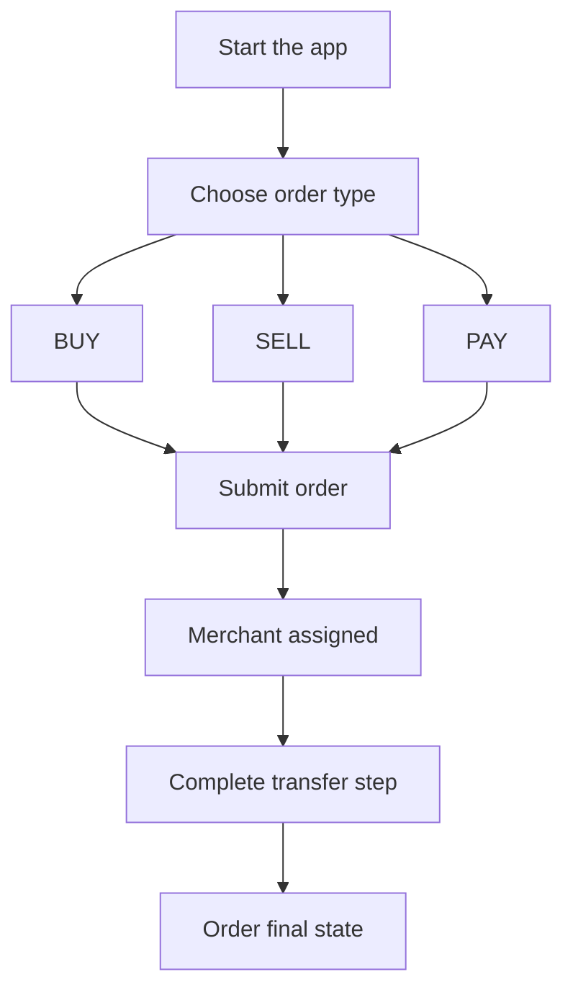

# For Users

## Start Here

This guide covers everything you need to buy, sell, or pay with stablecoins using P2P Protocol.

Jump to a section:

- [Before you start](/for-users/before-you-start)
- [Order types](/for-users/order-types)
- [How to place an order](/for-users/how-to-place-an-order)
- [What to do by order type](/for-users/what-to-do-by-order-type)
- [Understanding order states](/for-users/understanding-order-states)
- [Disputes and evidence](/for-users/disputes-and-evidence)
- [Troubleshooting](/for-users/troubleshooting)
- [FAQ](/for-users/faq)

Also see [`/for-merchants`](/for-merchants/start-here) to understand counterparty actions and [`/whitepaper`](/whitepaper/abstract) for protocol context.

---

## Before You Start

**What you need.**

- An account on a P2P Protocol client app. A wallet is provided in-app during sign-in, so you do not need to bring your own.
- Access to supported payment rails in your region.
- Stablecoin balance for `SELL`/`PAY` flows.

**Basic safety checks.**

- Confirm you are on the official app domain before signing in.
- Verify order details (amount, currency, recipient) before submission.
- Do not share your login credentials or account recovery information.

---

## Order Types

There are 3 types of orders supported, namely:

- **BUY**: you pay fiat and receive stablecoin.
- **SELL**: you transfer stablecoin and receive fiat.
- **PAY**: you transfer stablecoin to settle a payment over supported fiat rails.

---

## How to Place an Order

1. Open the app and select `BUY`, `SELL`, or `PAY`.
2. Enter amount and required recipient/payment details.
3. Submit order and wait for merchant assignment.
4. Follow app prompts for transfer and confirmation.

---

## What to Do by Order Type

### BUY (Fiat to Stablecoin)

1. Place `BUY` order.
2. Receive assigned merchant payment details.
3. Send fiat using the instructed rail.
4. Complete required in-app confirmation.
5. Track order until completion.

### SELL / PAY (Stablecoin to Fiat or Payment Rail)

1. Place a `SELL` or `PAY` order.
2. Approve and transfer the stablecoin when prompted.
3. Wait for the counterparty to settle to your destination.
4. Confirm completion in-app once the counterparty has settled, then track the order to the `COMPLETED` state.

---

## Understanding Order States

| Status | Meaning |
|--------|---------|
| `PLACED` | Order created and pending active handling |
| `ACCEPTED` | A merchant accepted the order |
| `PAID` | You marked that you sent the fiat payment (BUY orders). The merchant then releases the stablecoin. |
| `COMPLETED` | Settlement path finished successfully |
| `CANCELLED` | Order was cancelled or expired |

If your order remains in a state longer than expected, use in-app support/escalation and check dispute eligibility.

---

## Disputes and Evidence

If the counterparty does not fulfill their obligation, you can raise a dispute on-chain. Eligibility depends on the order type and status.

- BUY orders: a dispute can be raised between 15 minutes and 24 hours after the order was placed, and only if you marked the order as paid before it was cancelled.
- SELL and PAY orders: a dispute can be raised between 30 minutes and 7 days after the order was placed, and only after the order reaches the COMPLETED state.

To raise a dispute:

1. Open the order and select the dispute option once the window is open.
2. Submit the requested evidence in-app. The protocol records a redacted reference to your payment as on-chain evidence.
3. Monitor the dispute status until it is settled.

A dispute can be raised only once per order.

Disputes are settled on-chain by an authorized admin who assigns fault. If the merchant is at fault, the order completes and the stablecoin settles to the recipient. If you are found at fault, the order stays cancelled and a reputation penalty applies, which an admin can reverse if you later show the claim was honest. Jury-based escalation tiers are planned for a future release.

---

## Troubleshooting

### Order was cancelled unexpectedly

- Check whether the order expired or a transfer step failed.
- Recreate order with correct details and complete steps promptly.

### Merchant not responding

- Wait for the protocol reassignment/timeout path where applicable.
- If conditions are met, raise a dispute with evidence.

### Transfer failed

- Confirm token approval/balance for `SELL`/`PAY`.
- Confirm rail details and payment confirmation steps for `BUY`.

---

## FAQ

### Do I need to understand on-chain mechanics?

No, you are not forced to understand on-chain mechanics. The client app handles all contract interaction. Follow the status prompts to fulfill your action.

### Why wasn't my order matched instantly?

Merchant assignment depends on real-time eligibility factors, including liquidity, channel status, volume limits, and operational availability. If no merchant qualifies, the order waits and is cancelled when it times out.

### Can I appeal a dispute?

No. In the current release a dispute can be raised only once per order, and an authorised admin settles it on-chain by assigning fault. There is no separate appeal step. Jury-based and governance-driven escalation tiers are planned for a future release.

### Is my identity stored on-chain?

No raw PII(Personally Identifiable Information) is stored on-chain. The protocol uses ZK-KYC proofs for identity verification and stores only commitments and verdicts on-chain.

### How do I know what to do next?

Your order status (`PLACED`, `ACCEPTED`, `PAID`, `COMPLETED`, `CANCELLED`) tells you. Each status implies a specific next action. The app guides you through it.
