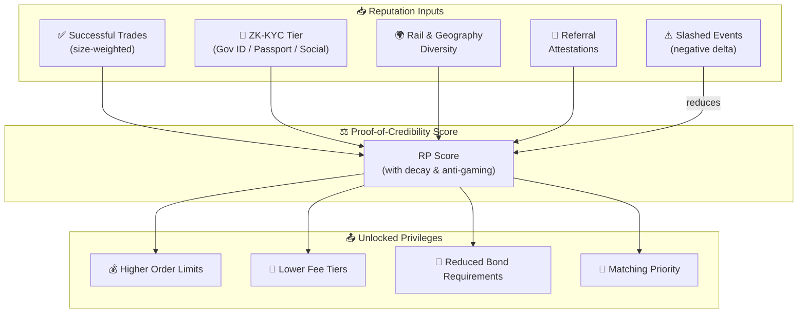

P2P Protocol works using a unique on-chain reputation system which not only builds up user trust and privileges but actively helps prevent fraudulent activity within the P2P landscape.

## 6.1 Building Trust Through Reputation

A user can increase their Reputation Points (RP) score via a series of on-chain tasks which make them more trustworthy in the eyes of the community. From completing anonymous KYC to referring friends, each newly completed task reinforces the user's on-chain reputation while unlocking fresh rights and benefits along with upgraded transaction limits.

## 6.2 Inputs (illustrative, governed)

- Successful trades (size-weighted), age/decay, dispute history.
- KYC proof tier (ZK-KYC completed, source diversity).
- Rail diversity & geography; referral attestations.
- Slashed events (negative deltas), appeals outcomes.

## 6.3 Outputs

- Order limits (min/max), fee tiers, bond multipliers, matching priority.
- Regional caps by compliance policy.

## 6.4 Sybil & Gaming Resistance

- Weighted decay, diminishing returns, rail-mix requirements, and anti-gaming and fraud detection engine checks.
- Optional attested device/account fingerprints (privacy-respecting commitments).

---
