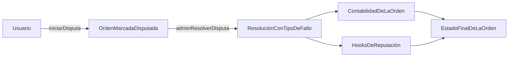

Un usuario inicia una disputa para una orden si se cumplen las condiciones de tiempo y estado. La orden se marca como disputada, el estado de disputa del merchant se actualiza, y un admin resuelve con un tipo de fallo (`USER`, `MERCHANT` o `BANK`). La resolución desencadena las vías de contabilidad de la orden y las actualizaciones de RP mediante hooks.

- Las ventanas de disputa varían según el tipo de orden.
- Una disputa no puede iniciarse dos veces.
- La resolución requiere autorización de un admin.

*Los niveles de escalación basados en jurado (T1 resolutor, T2 jurado, T3 gobernanza por token) y la auto-escalación basada en SLA están planificados para una versión futura.*

---
