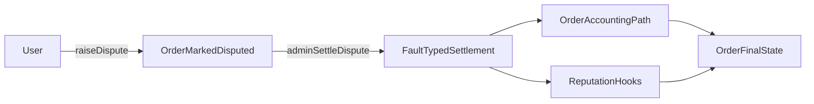

Un usuario abre una disputa sobre una orden cuando se cumplen las condiciones de tiempo y estado de dicha orden. La orden queda marcada como disputada y se actualiza el estado de disputa del comerciante. Un titular de la capacidad de resolver disputas para el círculo de la orden procede a liquidarla indicando un tipo de falla (`USER`, `MERCHANT` o `BANK`). La liquidación desencadena las rutas de contabilidad y de órdenes, y los [RP](/es/for-builders/reputation) (Puntos de Reputación) se actualizan mediante hooks.

- Las ventanas de disputa varían según el tipo de orden.
- Una disputa no puede abrirse dos veces.
- La liquidación requiere autorización de administrador.

*Los niveles de escalado basados en jurado (resolutor T1, jurado T2, gobernanza de token T3) y el escalado automático basado en SLA están planificados para una versión futura.*

---
