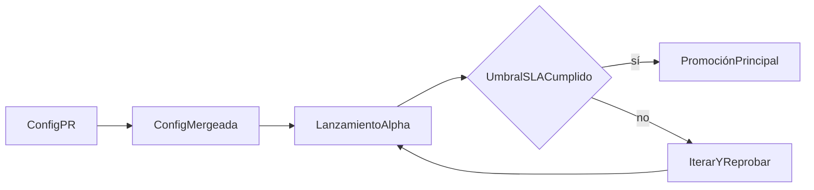

Agregar un nuevo país hoy requiere coordinación manual sin un proceso estándar. El conocimiento local está aislado. El framework de expansión resuelve esto haciendo que las configuraciones de país sean open-source y los criterios de promoción sean transparentes.

- Configuraciones YAML de país open-source que capturan el conocimiento local de rieles de pago
- Entorno alpha donde nuevas monedas se lanzan con la advertencia explícita de "sin SLA garantizado"
- Métricas de salud públicas (tasa de liquidación, tasa de disputas, volumen) que condicionan la promoción a la app principal

El cuello de botella para la expansión geográfica es el conocimiento local. Las configuraciones open-source permiten que cualquiera con experiencia local proponga una nueva moneda. Las puertas de SLA públicas aseguran la calidad sin requerir que la sede central evalúe manualmente cada mercado.

---
