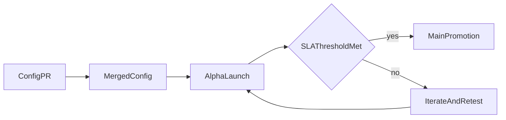

Agregar un nuevo país hoy requiere coordinación manual sin un proceso estándar. El conocimiento local está fragmentado. El marco de expansión resuelve esto haciendo que las configuraciones de países sean de código abierto y los criterios de promoción sean transparentes.

- Configuraciones YAML de países de código abierto que capturan el conocimiento local sobre rieles de pago
- Entorno alfa donde las nuevas divisas se lanzan con el encuadre explícito de "SLA no garantizado"
- Métricas de salud públicas (tasa de liquidación, tasa de disputas, volumen) que condicionan la promoción a la aplicación principal

El cuello de botella para la expansión geográfica es el conocimiento local. Las configuraciones de código abierto permiten que cualquier persona con experiencia local proponga una nueva divisa. Las compuertas de SLA públicas garantizan la calidad sin requerir que la sede evalúe manualmente cada mercado.

---
