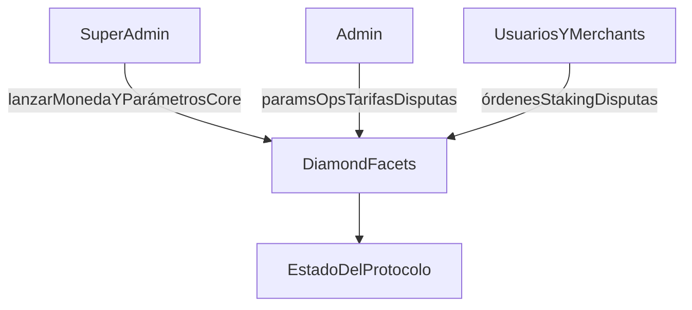

El protocolo define tres ámbitos de gobernanza.

**Super admin** lanza monedas, establece los parámetros principales de riesgo/límites y gestiona la configuración crítica del protocolo.

**Admin** gestiona los parámetros operativos, incluyendo el spread, los porcentajes de comisión a merchants, las disputas y las acciones sobre merchants/canales de pago.

**Merchant y usuario** cubre el ciclo de vida de órdenes, los flujos de staking/registro y la iniciación de disputas de acuerdo con las reglas del contrato.

---
