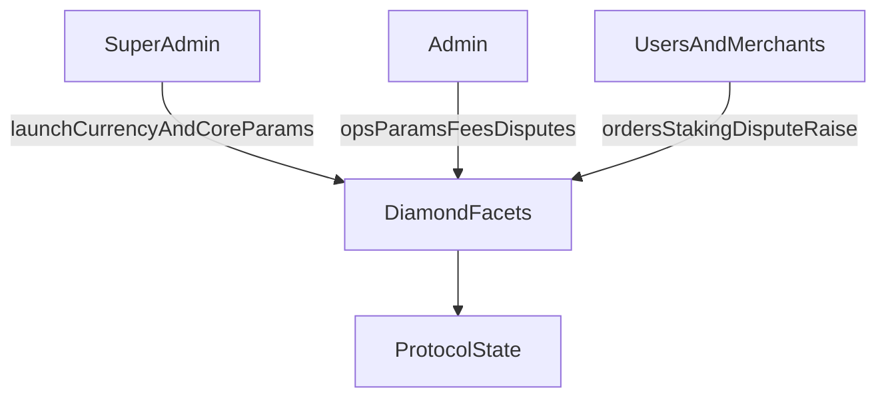

El protocolo utiliza control de acceso basado en capacidades (RBAC), aplicado a través de `CapabilityFacet` y `LibCapability`.

- **Super admin** lanza monedas, establece los parámetros centrales de riesgo y límites, gestiona la configuración crítica del protocolo y designa administradores globales.

- **Admin global** posee permisos en todos los circles, cubriendo parámetros operativos como el spread, los porcentajes de comisión de comerciantes y las acciones sobre comerciantes y canales de pago.

- **Admin de circle** otorga y revoca capacidades con alcance de circle dentro de su propio circle (los super admins también pueden hacerlo), controlando acciones como la resolución de disputas para órdenes en ese circle.

- **Comerciantes y usuarios** impulsan el ciclo de vida de las órdenes, los flujos de staking y registro, y la iniciación de disputas de acuerdo con las reglas del contrato.

---
