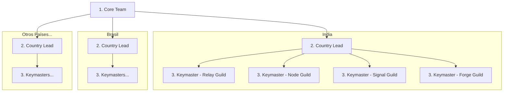

| Nivel | Rol | Nombre Código |
|-------|-----|---------------|
| Core Team | Fundadores y líderes del protocolo | "Core Team" |
| Country Lead | Gestiona todos los tracks en un país | "Country Lead" |
| Coordinador | Coordinadores de track | "Keymaster" |
| Contribuidor | Embajadores de la comunidad | "Cipher" |

Cada "Keymaster" gestiona hasta 5 "Ciphers".

## Responsabilidades del Country Lead

Cada "Country Lead" gestiona los cuatro tracks en su país.

| Nombre Código | Alcance |
|---------------|---------|
| **Relay Guild** | Canales de Discord/Telegram del país |
| **Node Guild** | Universidades y eventos locales |
| **Signal Guild** | Redes sociales regionales (contenido en idioma local) |
| **Forge Guild** | Traducciones, comunidad local de devs |

---
