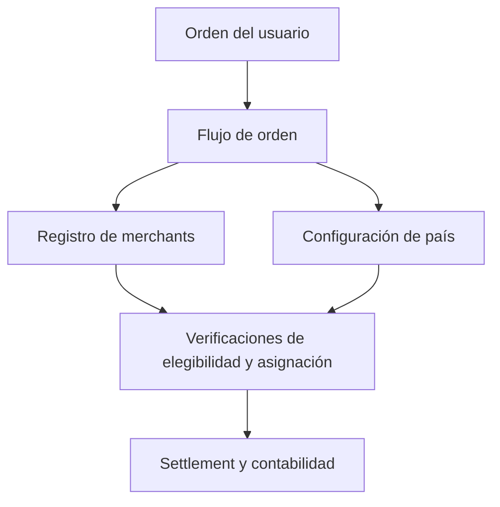

Un Círculo de Confianza es un colectivo de merchants respaldado por la comunidad y operado por un Circle Admin. Cada Círculo funciona como una unidad semi-autónoma dentro del protocolo, gestionando su propia red de merchants mientras cumple con las reglas on-chain compartidas del protocolo.

Los Círculos organizan a los merchants en grupos responsables, permiten la supervisión comunitaria mediante staking y delegación, y distribuyen el riesgo a través de pools de seguro escalonados.

El registro de merchants es el núcleo operativo que los Círculos envuelven. Todas las operaciones de merchants son on-chain y controladas por roles.

*Las entidades de Círculo de primera clase con ciclo de vida dedicado, roles de Circle Admin con requisitos de stake explícitos, y agrupación de merchants por Círculo están planificadas para una versión futura.*

---
