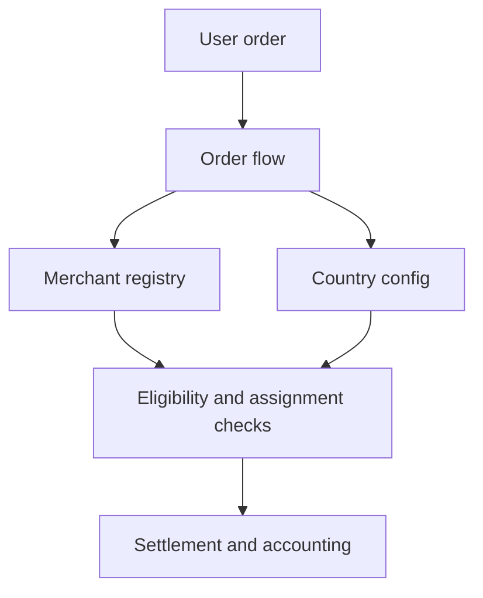

Un Circles of Trust es un colectivo de comerciantes respaldado por la comunidad y operado por un Circle Admin. Cada Circle funciona como una unidad semi-autónoma dentro del protocolo, gestionando su propia red de comerciantes mientras cumple las reglas compartidas del protocolo en cadena.

Los Circles organizan a los comerciantes en grupos con responsabilidad, habilitan la supervisión comunitaria mediante staking y delegación, y distribuyen el riesgo a través de fondos de seguro por niveles.

El registro de comerciantes es el núcleo operativo que los Circles envuelven. Todas las operaciones de comerciantes están en cadena y controladas por roles.

*Las entidades Circle de primera clase con ciclo de vida dedicado, los roles de Circle Admin con requisitos explícitos de stake y la agrupación de comerciantes por Circle están planificados para una versión futura.*

---
