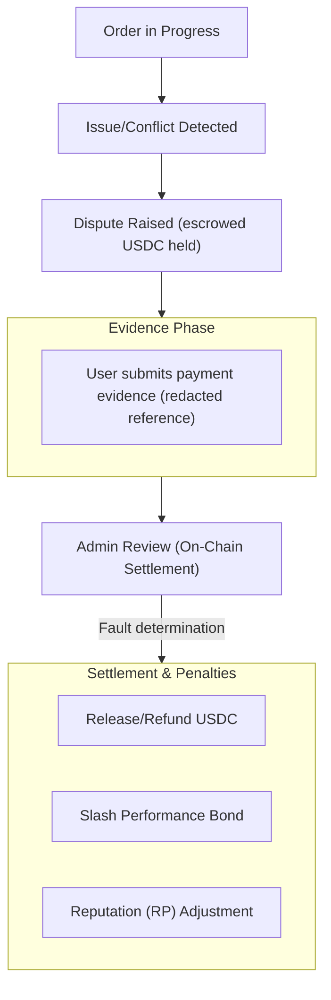

Si se inicia una disputa, siga estos pasos.

1. Revise el contexto del pedido y las marcas de tiempo.
2. Envíe evidencia de respaldo dentro de la aplicación.
3. Siga las actualizaciones del proceso de resolución y las transiciones de estado del pedido resultantes.

Las disputas se resuelven en cadena por el Administrador de Círculo del pedido (o un titular de capacidad autorizado para ese Círculo), quien determina la responsabilidad del usuario o del comerciante. Las ventanas de disputa regulan cuándo puede iniciarse una disputa.

*Los niveles de escalación basados en jurado y la finalidad mediante votación de gobernanza para las disputas están planificados para una versión futura.*

---
