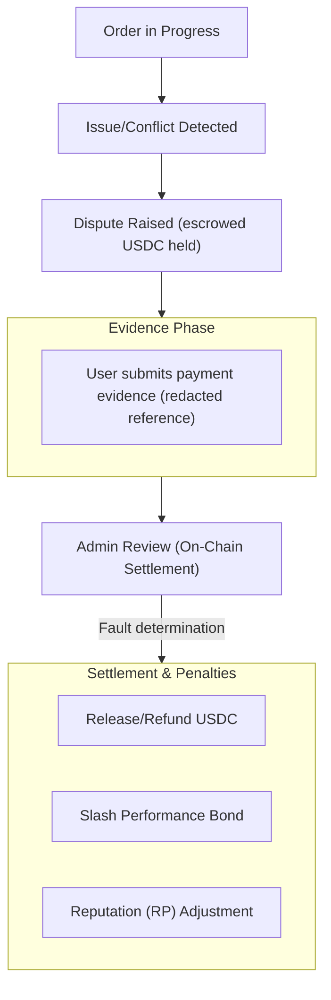

Si se inicia una disputa, sigue estos pasos.

1. Revisa el contexto del pedido y las marcas de tiempo.
2. Envía evidencia de respaldo dentro de la aplicación.
3. Sigue las actualizaciones de liquidación y las transiciones de estado del pedido resultantes.

Las disputas se resuelven en cadena por el Administrador de Círculo del pedido (o un titular de capacidad autorizado para ese Círculo), quien determina la responsabilidad del usuario o del comerciante. Las ventanas de disputa regulan cuándo puede iniciarse una disputa.

Las ventanas se aplican en cadena por tipo de pedido. Para un pedido de compra, el usuario puede iniciar una disputa desde los 15 minutos posteriores a la colocación del pedido hasta 24 horas después. Una disputa de compra también requiere que el pedido esté en estado cancelado con una marca de tiempo de pago registrada. Para un pedido de venta o de pago, la ventana va desde los 30 minutos posteriores a la colocación hasta 7 días después. Los intentos fuera de estos límites son revertidos.

| Tipo de pedido | Apertura más temprana de disputa | Apertura más tardía de disputa |
|----------------|----------------------------------|-------------------------------|
| Compra | 15 minutos después de la colocación | 24 horas después de la colocación |
| Venta o pago | 30 minutos después de la colocación | 7 días después de la colocación |

*Los niveles de escalación basados en jurado y la finalidad mediante votación de gobernanza para las disputas están planificados para una versión futura.*

---
