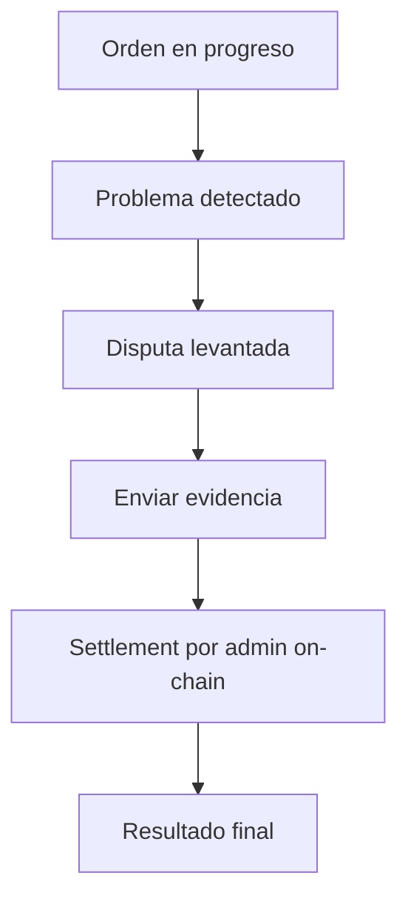

Si se levanta una disputa, sigue estos pasos.

1. Revisa el contexto de la orden y las marcas de tiempo.
2. Envía evidencia de respaldo en la app.
3. Sigue las actualizaciones de settlement y las transiciones de estado de la orden resultantes.

Las disputas se resuelven on-chain por admins autorizados bajo las reglas de falta del protocolo y las ventanas de disputa.

*Los niveles de escalación basados en jurado y la finalidad por voto de gobernanza para disputas están planificados para una versión futura.*

---
