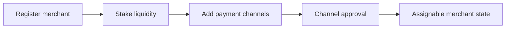

## Paso 1 Registro y Staking

1. Regístrate como comerciante para una moneda activa.
2. Deposita en staking la liquidez de liquidación requerida.
3. Confirma tu perfil de comerciante y estado operativo.

## Paso 2 Agregar Canales de Pago

1. Agrega canales de pago para los rieles que soportas.
2. Espera los estados de aprobación requeridos.
3. Mantén los canales aprobados activos y actualizados.

## Capacidad de Pedidos y Reglas de Cuenta

Tu capacidad de compra por pedido se deriva de tus Reputation Points y la moneda en la que operas, no de un múltiplo fijo de tu stake. La relación se define por moneda. Los valores a continuación son los valores por defecto actuales; el valor vigente se muestra en la aplicación.

| Moneda | Tasa de capacidad | Límite por transacción | Límite de volumen anual |
|--------|-------------------|------------------------|------------------------|
| INR | 1 RP equivale a $1 USDC | $400 USDC | $20,000 USDC |
| BRL | 1 RP equivale a $2 USDC | $400 USDC | $20,000 USDC |
| IDR | 1 RP equivale a $2 USDC | $400 USDC | $20,000 USDC |
| ARS | 1 RP equivale a $1 USDC | $400 USDC | (definido por moneda) |

Los Reputation Points se acumulan mediante verificación y a través de hitos de volumen acumulado en $1,000, $5,000, $20,000 y $50,000 USDC. El número de pedidos también está sujeto a límites. Los valores por defecto actuales son 5 pedidos de compra por día, 25 pedidos de compra por mes y un límite de venta diario igual a diez veces tu límite de venta por transacción. Los valores vigentes se muestran en la aplicación.

Las reglas de cuenta y de canal de pago varían por país y se aplican en la aplicación. Opera únicamente desde cuentas a tu propio nombre. En algunos mercados, el mensaje genérico de "agregar más canales de pago" no aplica, por lo que debes seguir las instrucciones en la aplicación correspondientes a tu país.

---
