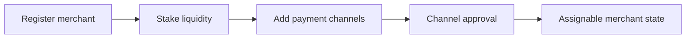

## Paso 1 Registro y Staking

1. Regístrate como comerciante para una moneda activa.
2. Deposita en staking la liquidez de liquidación requerida.
3. Confirma tu perfil de comerciante y estado operativo.

## Paso 2 Agregar Canales de Pago

1. Agrega canales de pago para los rieles que soportas.
2. Espera los estados de aprobación requeridos.
3. Mantén los canales aprobados activos y actualizados.

---
