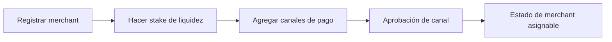

## Paso 1: Registrarse y hacer Stake

1. Regístrate como merchant para una moneda activa.
2. Haz stake de la liquidez de settlement requerida.
3. Confirma tu perfil de merchant y estado operativo.

## Paso 2: Agregar Canales de Pago

1. Agrega canales de pago para tus rieles soportados.
2. Espera a los estados de aprobación requeridos.
3. Mantén los canales aprobados activos y actualizados.

---
