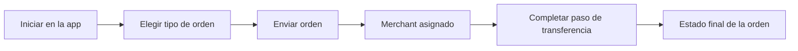

1. Abrí la app y seleccioná `BUY`, `SELL` o `PAY`.
2. Ingresá el monto y los datos requeridos del destinatario/pago.
3. Enviá la orden y esperá la asignación de un merchant.
4. Seguí las instrucciones de la app para la transferencia y confirmación.

---
