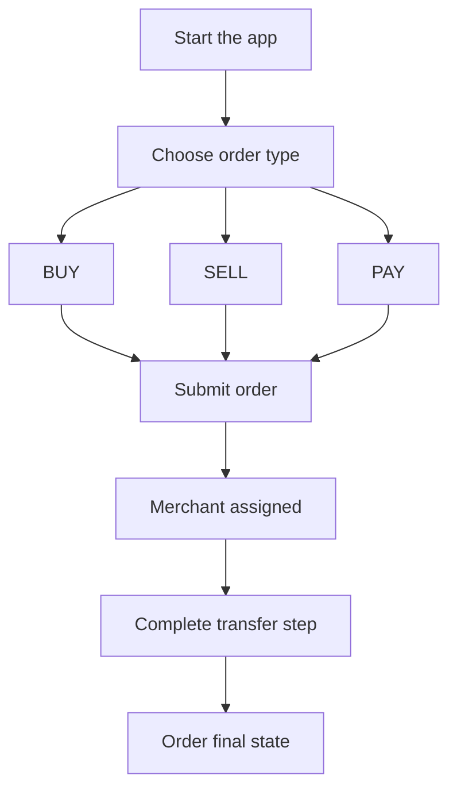

1. Abre la aplicación y selecciona `BUY`, `SELL` o `PAY`.
2. Ingresa el monto y los datos del destinatario o del pago requeridos.
3. Envía el pedido y espera la asignación de un comerciante.
4. Sigue las instrucciones de la aplicación para completar la transferencia y la confirmación.

---
