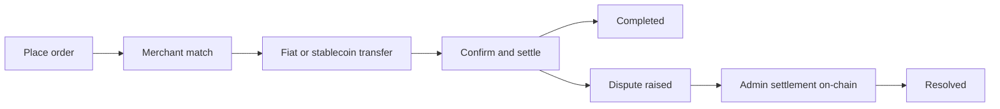

## 3.1 Actores

El protocolo involucra a varios participantes clave que trabajan en conjunto para habilitar transacciones entre pares sin necesidad de confianza mutua.

**Los compradores y vendedores** son usuarios cotidianos que inician órdenes de entrada o salida de fondos (on-ramp u off-ramp). Interactúan con el protocolo a través de aplicaciones cliente que utilizan billeteras integradas, realizando transacciones sin ceder la custodia de sus fondos.

**Los comerciantes**, también conocidos como pares de liquidez, actúan como contrapartes que median la liquidez entre stablecoins y monedas fiduciarias. Son participantes cuidadosamente verificados que mantienen liquidez suficiente y han construido sólidas reputaciones a través del sistema Proof-of-Credibility.

**Los contratos del protocolo** son los contratos inteligentes en cadena que orquestan todo el ciclo de vida de las órdenes. Se encargan de la gestión de colas, el emparejamiento basado en puntuaciones de credibilidad, la verificación de estado y los resultados de liquidación final. Estos contratos operan actualmente en Base L2 (con expansión multicadena a Solana planificada).

**Los verificadores de pruebas** validan actualmente las pruebas ZK-KYC para la verificación de identidad (documentos de identidad gubernamentales, cuentas sociales y pasaportes mediante Reclaim Protocol y otros verificadores ZK). La verificación de transacciones bancarias está planificada (véase la [Sección 4.2](/es/whitepaper/cryptographic-primitives-proof-integration)).

**La gobernanza** está distribuida en dos capas. Los parámetros del protocolo y las actualizaciones en Base son gobernados por los titulares de $P2P a través de un Governor en cadena, mientras que la emisión de tokens, los cambios en el suministro y la asignación del tesoro son gobernados en Solana a través del mercado de decisiones en cadena de MetaDAO. La implementación actual opera bajo administración/multifirma, con una transición hacia una gobernanza más amplia de los titulares de tokens en curso a medida que el protocolo madura.

## 3.2 Componentes

- **Contratos inteligentes en Base L2** (con expansión a Solana) para el ciclo de vida de las órdenes, emparejamiento, ventanas de disputas, registro de parámetros y enrutamiento de comisiones.
- **Registro de reputación** que implementa Proof-of-Credibility (entradas, puntuación, penalizaciones).
- **Adaptador de oráculo** para precios de referencia y salvaguardas (mediana/TWAP, respaldos, disyuntores).
- **SDKs de cliente** y aplicaciones de referencia (p. ej., Coins.me) que interactúan con el protocolo.

## 3.3 Flujo de Alto Nivel

1. **Colocación de órdenes:** Un usuario hace clic en “Comprar USDC” (o “Vender USDC”) e ingresa el monto. La aplicación proporciona una billetera integrada para la transacción.
2. **Emparejamiento de órdenes:** Se asigna un comerciante en cadena en función del USDC bloqueado en garantía. Una dirección de pago fiduciario se comparte a través del contrato inteligente, cifrada con las claves del usuario. Para los off-ramps, se presenta una dirección USDC en Base (con expansión a Solana).
3. **Transferencia de fondos fiduciarios o stablecoins:** El pagador realiza la transferencia por el canal designado.
4. **Confirmación y liquidación:** En cuestión de minutos, la liquidación se completa una vez que el comerciante confirma la recepción. Los saldos de las billeteras se actualizan en consecuencia.
5. **Ventana de disputa:** Si una de las partes impugna, presenta evidencia de que un pago o acción ocurrió (o no ocurrió). En la implementación actual, administradores autorizados resuelven las órdenes disputadas en cadena conforme a las reglas de falta del protocolo y las ventanas de disputa.



## 3.4 Flujo de On-Ramp

```
┌─────────────────────────────────────────────────────────────────────────┐
│                         ON-RAMP FLOW (Fiat → USDC)                      │
├─────────────────────────────────────────────────────────────────────────┤
│                                                                         │
│   ┌──────────┐         ┌──────────────┐         ┌──────────────┐        │
│   │   USER   │         │   PROTOCOL   │         │   MERCHANT   │        │
│   └────┬─────┘         └──────┬───────┘         └──────┬───────┘        │
│        │                      │                        │                │
│        │  1. Open BUY order   │                        │                │
│        │  (amount + rail)     │                        │                │
│        │─────────────────────►│                        │                │
│        │                      │                        │                │
│        │                      │  2. Match via PoC      │                │
│        │                      │  (credibility score)   │                │
│        │                      │───────────────────────►│                │
│        │                      │                        │                │
│        │  3. Receive fiat     │                        │                │
│        │  payment address     │                        │                │
│        │◄─────────────────────│                        │                │
│        │  (encrypted)         │                        │                │
│        │                      │                        │                │
│        │  4. Transfer fiat    │                        │                │
│        │  via UPI/PIX/SPEI    │                        │                │
│        │──────────────────────────────────────────────►│                │
│        │                      │                        │                │
│        │                      │  5. Merchant confirms  │                │
│        │                      │  receipt               │                │
│        │                      │◄───────────────────────│                │
│        │                      │                        │                │
│        │  6. USDC released    │                        │                │
│        │  to user wallet      │                        │                │
│        │◄─────────────────────│                        │                │
│        │                      │                        │                │
│   ┌────▼─────┐         ┌──────▼───────┐         ┌──────▼───────┐        │
│   │  USDC    │         │    FEES      │         │   BONDS      │        │
│   │ RECEIVED │         │  COLLECTED   │         │  UNLOCKED    │        │
│   └──────────┘         └──────────────┘         └──────────────┘        │
│                                                                         │
└─────────────────────────────────────────────────────────────────────────┘
```

## 3.5 Flujo de Off-Ramp

```
┌─────────────────────────────────────────────────────────────────────────┐
│                        OFF-RAMP FLOW (USDC → Fiat)                      │
├─────────────────────────────────────────────────────────────────────────┤
│                                                                         │
│   ┌──────────┐         ┌──────────────┐         ┌──────────────┐        │
│   │   USER   │         │   PROTOCOL   │         │   MERCHANT   │        │
│   └────┬─────┘         └──────┬───────┘         └──────┬───────┘        │
│        │                      │                        │                │
│        │  1. Open SELL order  │                        │                │
│        │  + lock USDC         │                        │                │
│        │─────────────────────►│                        │                │
│        │                      │                        │                │
│        │                      │  2. Match via PoC      │                │
│        │                      │  + merchant posts bond │                │
│        │                      │───────────────────────►│                │
│        │                      │                        │                │
│        │  3. Share fiat       │                        │                │
│        │  receiving address   │                        │                │
│        │─────────────────────►│                        │                │
│        │  (encrypted)         │                        │                │
│        │                      │                        │                │
│        │                      │  4. Merchant sends     │                │
│        │  Fiat received       │  fiat payment          │                │
│        │◄──────────────────────────────────────────────│                │
│        │                      │                        │                │
│        │                      │  5. Merchant submits   │                │
│        │                      │  payment confirmation  │                │
│        │                      │◄───────────────────────│                │
│        │                      │                        │                │
│        │                      │  6. USDC released      │                │
│        │                      │  to merchant           │                │
│        │                      │───────────────────────►│                │
│        │                      │                        │                │
│   ┌────▼─────┐         ┌──────▼───────┐         ┌──────▼───────┐        │
│   │  FIAT    │         │    FEES      │         │    USDC      │        │
│   │ RECEIVED │         │  COLLECTED   │         │  RECEIVED    │        │
│   └──────────┘         └──────────────┘         └──────────────┘        │
│                                                                         │
└─────────────────────────────────────────────────────────────────────────┘
```

## 3.6 Consideraciones Clave

- El **comerciante** cumple la función de mediar la liquidez para las transacciones.
- La **responsabilidad de confirmar el pago** recae en el comerciante (para los off-ramps) o puede ser proporcionada por cualquiera de las partes.
- **ZK-KYC realiza la verificación de identidad sin necesidad de confianza** para el usuario sin exponer datos personales.
- **Las evidencias se presentan y revisan** en las disputas. En el sistema actual, los resultados se ejecutan mediante liquidación administrativa en cadena. La resolución más amplia impulsada por verificadores y gobernanza permanece en la hoja de ruta (véase la [Sección 4.2](/es/whitepaper/cryptographic-primitives-proof-integration)).
- **Reclaim Protocol** habilita la verificación que preserva la privacidad de cuentas sociales mediante zkTLS. Aadhaar se verifica a través de Anon Aadhaar, y los pasaportes o documentos de identidad nacionales a través de ZKPassport.

---
