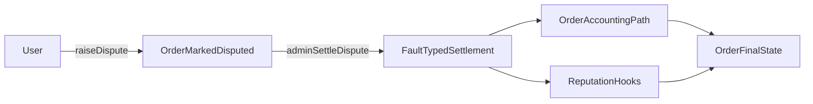

Pengguna mengajukan sengketa untuk suatu pesanan apabila kondisi waktu dan status pesanan terpenuhi. Pesanan ditandai sebagai disengketakan dan status sengketa merchant diperbarui. Pemegang kemampuan penyelesaian sengketa untuk lingkaran pesanan tersebut kemudian menyelesaikan sengketa dengan jenis kesalahan (`USER`, `MERCHANT`, atau `BANK`). Penyelesaian memicu jalur pesanan dan akuntansi, serta [RP](/id/for-builders/reputation) (Poin Reputasi) diperbarui melalui hooks.

- Jendela sengketa berbeda berdasarkan jenis pesanan.
- Sengketa tidak dapat diajukan dua kali.
- Penyelesaian memerlukan otorisasi admin.

*Tingkat eskalasi berbasis juri (resolver T1, juri T2, tata kelola token T3) dan eskalasi otomatis berbasis SLA direncanakan untuk rilis mendatang.*

---
