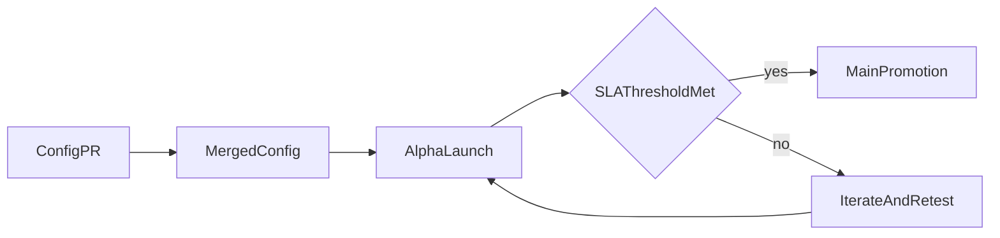

Menambahkan negara baru saat ini memerlukan koordinasi manual tanpa proses yang terstandar. Pengetahuan lokal tersebar dan tidak terhubung. Kerangka ekspansi mengatasi hal ini dengan membuat konfigurasi negara bersifat open-source dan kriteria promosi bersifat transparan.

- Konfigurasi YAML negara yang bersifat open-source, menangkap pengetahuan jalur pembayaran lokal
- Lingkungan Alpha tempat mata uang baru diluncurkan dengan framing eksplisit "tidak ada SLA yang dijamin"
- Metrik kesehatan publik (tingkat penyelesaian, tingkat sengketa, volume) yang menjadi syarat promosi ke aplikasi utama

Hambatan utama ekspansi geografis adalah pengetahuan lokal. Konfigurasi open-source memungkinkan siapa saja yang memiliki keahlian lokal untuk mengusulkan mata uang baru. Gerbang SLA publik memastikan kualitas tanpa mengharuskan kantor pusat mengevaluasi setiap pasar secara manual.

---
