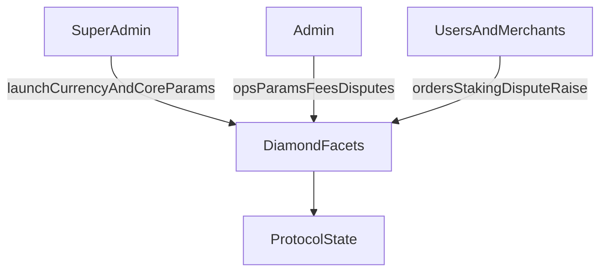

Protokol menggunakan kontrol akses berbasis kemampuan (RBAC), yang diterapkan melalui `CapabilityFacet` dan `LibCapability`.

- **Super admin** meluncurkan mata uang, menetapkan parameter risiko/batas inti, mengelola konfigurasi protokol yang kritis, dan menunjuk admin global.

- **Admin global** memiliki izin di semua circle, mencakup parameter operasional seperti spread, persentase biaya merchant, serta tindakan merchant/saluran pembayaran.

- **Admin circle** memberikan dan mencabut kemampuan yang tercakup dalam circle-nya sendiri (super admin juga dapat melakukan hal yang sama), membatasi tindakan seperti penyelesaian sengketa untuk pesanan dalam circle tersebut.

- **Merchant dan pengguna** menjalankan siklus hidup pesanan, alur staking dan registrasi, serta pengajuan sengketa sesuai aturan kontrak.

---
