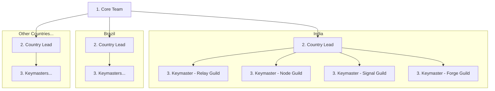

| Level        | Peran                                     | Nama Kode      |
| ------------ | ----------------------------------------- | -------------- |
| Core Team    | Pendiri dan pimpinan protokol             | "Core Team"    |
| Country Lead | Mengelola semua jalur di suatu negara     | "Country Lead" |
| Coordinator  | Koordinator jalur                         | "Keymaster"    |
| Contributor  | Ambassador komunitas                      | "Cipher"       |

Setiap "Keymaster" mengelola hingga 5 "Cipher".

## Tanggung Jawab Country Lead

Setiap "Country Lead" mengelola keempat jalur di negaranya.

| Nama Kode        | Cakupan                                                        |
| ---------------- | -------------------------------------------------------------- |
| **Relay Guild**  | Saluran Discord/Telegram negara                                |
| **Node Guild**   | Kampus dan acara lokal                                         |
| **Signal Guild** | Media sosial regional (konten dalam bahasa lokal)              |
| **Forge Guild**  | Terjemahan, komunitas pengembang lokal                         |

---
