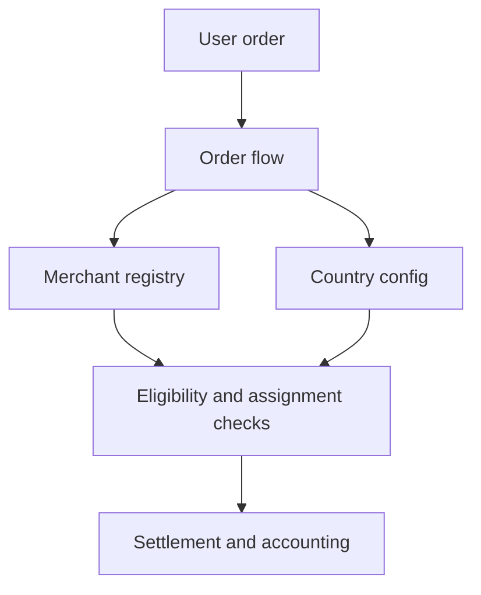

Circles of Trust adalah kumpulan merchant yang didukung komunitas dan dioperasikan oleh seorang Circle Admin. Setiap Circle berfungsi sebagai unit semi-otonom dalam protokol, mengelola jaringan merchantnya sendiri sambil mematuhi aturan protokol on-chain yang berlaku bersama.

Circles mengorganisasi merchant ke dalam kelompok-kelompok yang bertanggung jawab, memungkinkan pengawasan komunitas melalui staking dan delegasi, serta mendistribusikan risiko melalui kumpulan asuransi bertingkat.

Registri merchant adalah inti operasional yang dibungkus oleh Circles. Semua operasi merchant bersifat on-chain dan dibatasi oleh peran.

*Entitas Circle kelas pertama dengan siklus hidup tersendiri, peran Circle Admin dengan persyaratan stake yang eksplisit, serta pengelompokan merchant dalam lingkup Circle direncanakan untuk rilis mendatang.*

---
