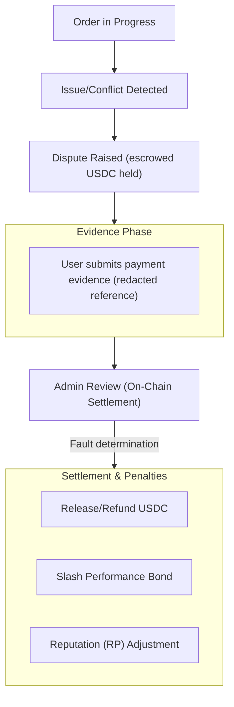

Jika sengketa diajukan, ikuti langkah-langkah berikut.

1. Tinjau konteks pesanan dan stempel waktu.
2. Kirimkan bukti pendukung melalui aplikasi.
3. Ikuti pembaruan penyelesaian dan transisi status pesanan yang dihasilkan.

Sengketa diselesaikan secara on-chain oleh Circle Admin dari pesanan (atau pemegang kapabilitas yang diotorisasi untuk Circle tersebut), yang menentukan kesalahan pengguna atau merchant. Jendela sengketa mengatur kapan sengketa dapat diajukan.

Jendela-jendela ini diterapkan secara on-chain berdasarkan jenis pesanan. Untuk pesanan beli, pengguna dapat mengajukan sengketa mulai dari 15 menit setelah pesanan ditempatkan hingga 24 jam setelah pesanan ditempatkan. Sengketa pesanan beli juga mensyaratkan pesanan berada dalam status dibatalkan dengan stempel waktu pembayaran yang tercatat. Untuk pesanan jual atau bayar, jendela berlaku dari 30 menit setelah penempatan hingga 7 hari setelah penempatan. Pengajuan di luar batas-batas ini akan dibatalkan.

| Jenis pesanan | Paling awal sengketa dapat dibuka | Paling lambat sengketa dapat dibuka |
|---------------|-----------------------------------|--------------------------------------|
| Beli | 15 menit setelah penempatan | 24 jam setelah penempatan |
| Jual atau bayar | 30 menit setelah penempatan | 7 hari setelah penempatan |

*Tingkatan eskalasi berbasis juri dan finalitas melalui pemungutan suara tata kelola untuk sengketa direncanakan untuk rilis mendatang.*

---
