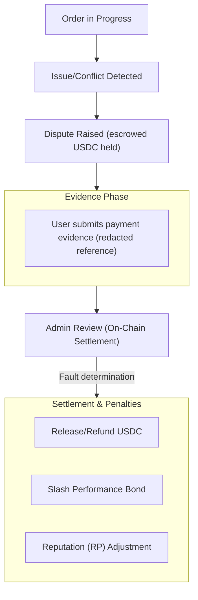

Jika sengketa diajukan, ikuti langkah-langkah berikut.

1. Tinjau konteks pesanan dan stempel waktu.
2. Kirimkan bukti pendukung melalui aplikasi.
3. Ikuti pembaruan penyelesaian dan transisi status pesanan yang dihasilkan.

Sengketa diselesaikan secara on-chain oleh Circle Admin dari pesanan (atau pemegang kapabilitas yang diotorisasi untuk Circle tersebut), yang menentukan kesalahan pengguna atau merchant. Jendela sengketa mengatur kapan sengketa dapat diajukan.

*Tingkatan eskalasi berbasis juri dan finalitas melalui pemungutan suara tata kelola untuk sengketa direncanakan untuk rilis mendatang.*

---
