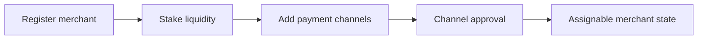

## Langkah 1 Daftar dan Lakukan Stake

1. Daftar sebagai merchant untuk mata uang yang aktif.
2. Lakukan stake likuiditas penyelesaian yang diperlukan.
3. Konfirmasi profil merchant dan status operasional Anda.

## Langkah 2 Tambahkan Saluran Pembayaran

1. Tambahkan saluran pembayaran untuk jalur pembayaran yang Anda dukung.
2. Tunggu status persetujuan yang diperlukan.
3. Jaga agar saluran yang disetujui tetap aktif dan mutakhir.

## Kapasitas Pesanan dan Aturan Akun

Kapasitas beli per pesanan Anda diturunkan dari Reputation Points dan mata uang yang Anda operasikan, bukan dari kelipatan tetap stake Anda. Hubungan ini ditetapkan per mata uang. Nilai di bawah ini adalah default saat ini, dan nilai live ditampilkan di aplikasi.

| Mata Uang | Tingkat kapasitas | Batas per transaksi | Batas volume tahunan |
|-----------|-------------------|---------------------|----------------------|
| INR | 1 RP setara $1 USDC | $400 USDC | $20,000 USDC |
| BRL | 1 RP setara $2 USDC | $400 USDC | $20,000 USDC |
| IDR | 1 RP setara $2 USDC | $400 USDC | $20,000 USDC |
| ARS | 1 RP setara $1 USDC | $400 USDC | (ditetapkan per mata uang) |

Reputation Points bertambah melalui verifikasi dan melalui pencapaian volume kumulatif pada $1,000, $5,000, $20,000, dan $50,000 USDC. Jumlah pesanan juga dibatasi. Default saat ini adalah 5 pesanan beli per hari, 25 pesanan beli per bulan, dan tunjangan jual harian setara sepuluh kali batas jual per transaksi Anda. Nilai live ditampilkan di aplikasi.

Aturan akun dan saluran pembayaran berbeda per negara dan diterapkan di dalam aplikasi. Operasikan hanya dari akun atas nama Anda sendiri. Di beberapa pasar, panduan umum "tambahkan lebih banyak saluran pembayaran" tidak berlaku, sehingga ikuti panduan di aplikasi untuk negara Anda.

---
