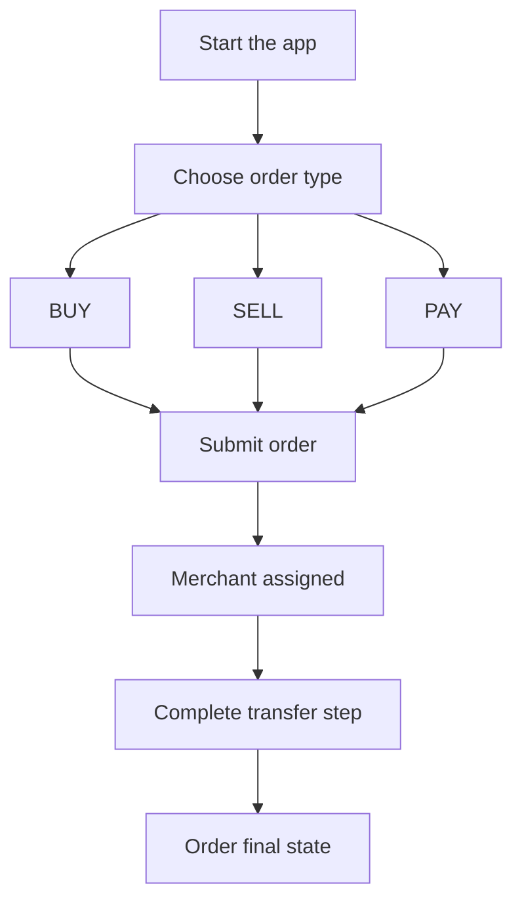

1. Buka aplikasi dan pilih `BUY`, `SELL`, atau `PAY`.
2. Masukkan jumlah serta detail penerima/pembayaran yang diperlukan.
3. Kirim pesanan dan tunggu penugasan merchant.
4. Ikuti petunjuk aplikasi untuk transfer dan konfirmasi.

---
