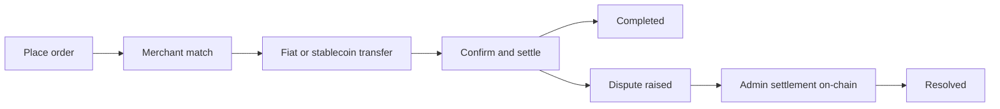

## 3.1 Pelaku

Protokol ini melibatkan beberapa peserta utama yang bekerja sama untuk memungkinkan transaksi peer-to-peer tanpa perlu kepercayaan pihak ketiga.

**Pembeli dan Penjual** adalah pengguna sehari-hari yang memulai order on-ramp atau off-ramp. Mereka berinteraksi dengan protokol melalui aplikasi klien menggunakan dompet terintegrasi dan bertransaksi tanpa menyerahkan kustodi atas dana mereka.

**Merchant**, yang juga dikenal sebagai liquidity peer, berfungsi sebagai pihak lawan yang menjadi perantara likuiditas antara stablecoin dan mata uang fiat. Mereka adalah peserta yang telah diverifikasi dengan cermat, menjaga likuiditas yang memadai, dan membangun reputasi yang kuat melalui sistem Proof-of-Credibility.

**Kontrak Protokol** adalah smart contract on-chain yang mengatur seluruh siklus hidup order. Kontrak ini menangani antrean order, pencocokan berdasarkan skor kredibilitas, verifikasi status, dan hasil penyelesaian akhir. Kontrak-kontrak ini saat ini beroperasi di Base L2 (ekspansi multichain ke Solana direncanakan).

**Proof Verifier** saat ini memvalidasi bukti ZK-KYC untuk verifikasi identitas (KTP pemerintah, akun media sosial, dan paspor melalui Reclaim Protocol dan verifier ZK lainnya). Verifikasi transaksi bank sedang direncanakan (lihat [Bagian 4.2](/id/whitepaper/cryptographic-primitives-proof-integration)).

**Governance** terbagi dalam dua lapisan. Parameter protokol dan peningkatan di Base diatur oleh pemegang $P2P melalui Governor on-chain, sementara pencetakan token, perubahan pasokan, dan alokasi treasury diatur di Solana melalui pasar keputusan on-chain MetaDAO. Implementasi saat ini dioperasikan oleh admin/multisig, dengan transisi menuju governance pemegang token yang lebih luas sedang berlangsung seiring kematangan protokol.

## 3.2 Komponen

- **Smart contract Base L2** (berkembang ke Solana) untuk siklus hidup order, pencocokan, jendela sengketa, registri parameter, dan perutean biaya.
- **Registri reputasi** yang mengimplementasikan Proof-of-Credibility (masukan, penilaian, dan penalti).
- **Adaptor oracle** untuk penetapan harga referensi dan pengamanan (median/TWAP, fallback, circuit breaker).
- **SDK klien** dan aplikasi referensi (contoh: Coins.me) yang berkomunikasi dengan protokol.

## 3.3 Alur Tingkat Tinggi

1. **Penempatan Order:** Pengguna mengklik "Beli USDC" (atau "Jual USDC") dan memasukkan jumlah. Aplikasi menyediakan dompet terintegrasi untuk transaksi.
2. **Pencocokan Order:** Merchant ditetapkan secara on-chain berdasarkan USDC yang distake. Alamat pembayaran fiat dibagikan melalui smart contract, dienkripsi dengan kunci pengguna. Untuk off-ramp, alamat USDC di Base (berkembang ke Solana) ditampilkan.
3. **Transfer Fiat/Stablecoin:** Pembayar melakukan transfer melalui jalur yang ditentukan.
4. **Konfirmasi/Penyelesaian:** Dalam beberapa menit, penyelesaian berhasil setelah merchant mengkonfirmasi penerimaan. Saldo dompet diperbarui sesuai.
5. **Jendela Sengketa:** Jika salah satu pihak mengajukan keberatan, mereka menyampaikan bukti bahwa pembayaran atau tindakan telah terjadi (atau tidak). Dalam implementasi yang berjalan, admin yang berwenang menyelesaikan order yang disengketakan secara on-chain sesuai aturan kesalahan protokol dan jendela sengketa.



## 3.4 Alur On-Ramp

```
┌─────────────────────────────────────────────────────────────────────────┐
│                         ON-RAMP FLOW (Fiat → USDC)                      │
├─────────────────────────────────────────────────────────────────────────┤
│                                                                         │
│   ┌──────────┐         ┌──────────────┐         ┌──────────────┐        │
│   │   USER   │         │   PROTOCOL   │         │   MERCHANT   │        │
│   └────┬─────┘         └──────┬───────┘         └──────┬───────┘        │
│        │                      │                        │                │
│        │  1. Open BUY order   │                        │                │
│        │  (amount + rail)     │                        │                │
│        │─────────────────────►│                        │                │
│        │                      │                        │                │
│        │                      │  2. Match via PoC      │                │
│        │                      │  (credibility score)   │                │
│        │                      │───────────────────────►│                │
│        │                      │                        │                │
│        │  3. Receive fiat     │                        │                │
│        │  payment address     │                        │                │
│        │◄─────────────────────│                        │                │
│        │  (encrypted)         │                        │                │
│        │                      │                        │                │
│        │  4. Transfer fiat    │                        │                │
│        │  via UPI/PIX/SPEI    │                        │                │
│        │──────────────────────────────────────────────►│                │
│        │                      │                        │                │
│        │                      │  5. Merchant confirms  │                │
│        │                      │  receipt               │                │
│        │                      │◄───────────────────────│                │
│        │                      │                        │                │
│        │  6. USDC released    │                        │                │
│        │  to user wallet      │                        │                │
│        │◄─────────────────────│                        │                │
│        │                      │                        │                │
│   ┌────▼─────┐         ┌──────▼───────┐         ┌──────▼───────┐        │
│   │  USDC    │         │    FEES      │         │   BONDS      │        │
│   │ RECEIVED │         │  COLLECTED   │         │  UNLOCKED    │        │
│   └──────────┘         └──────────────┘         └──────────────┘        │
│                                                                         │
└─────────────────────────────────────────────────────────────────────────┘
```

## 3.5 Alur Off-Ramp

```
┌─────────────────────────────────────────────────────────────────────────┐
│                        OFF-RAMP FLOW (USDC → Fiat)                      │
├─────────────────────────────────────────────────────────────────────────┤
│                                                                         │
│   ┌──────────┐         ┌──────────────┐         ┌──────────────┐        │
│   │   USER   │         │   PROTOCOL   │         │   MERCHANT   │        │
│   └────┬─────┘         └──────┬───────┘         └──────┬───────┘        │
│        │                      │                        │                │
│        │  1. Open SELL order  │                        │                │
│        │  + lock USDC         │                        │                │
│        │─────────────────────►│                        │                │
│        │                      │                        │                │
│        │                      │  2. Match via PoC      │                │
│        │                      │  + merchant posts bond │                │
│        │                      │───────────────────────►│                │
│        │                      │                        │                │
│        │  3. Share fiat       │                        │                │
│        │  receiving address   │                        │                │
│        │─────────────────────►│                        │                │
│        │  (encrypted)         │                        │                │
│        │                      │                        │                │
│        │                      │  4. Merchant sends     │                │
│        │  Fiat received       │  fiat payment          │                │
│        │◄──────────────────────────────────────────────│                │
│        │                      │                        │                │
│        │                      │  5. Merchant submits   │                │
│        │                      │  payment confirmation  │                │
│        │                      │◄───────────────────────│                │
│        │                      │                        │                │
│        │                      │  6. USDC released      │                │
│        │                      │  to merchant           │                │
│        │                      │───────────────────────►│                │
│        │                      │                        │                │
│   ┌────▼─────┐         ┌──────▼───────┐         ┌──────▼───────┐        │
│   │  FIAT    │         │    FEES      │         │    USDC      │        │
│   │ RECEIVED │         │  COLLECTED   │         │  RECEIVED    │        │
│   └──────────┘         └──────────────┘         └──────────────┘        │
│                                                                         │
└─────────────────────────────────────────────────────────────────────────┘
```

## 3.6 Pertimbangan Utama

- **Merchant** berfungsi sebagai perantara likuiditas untuk transaksi.
- **Kewajiban mengkonfirmasi pembayaran** berada pada merchant (untuk off-ramp) atau dapat diberikan oleh salah satu pihak.
- **ZK-KYC melakukan verifikasi identitas tanpa kepercayaan pihak ketiga** bagi pengguna tanpa mengekspos data pribadi.
- **Bukti disampaikan dan ditinjau** dalam sengketa. Dalam sistem yang berjalan, hasil dieksekusi melalui penyelesaian admin on-chain. Resolusi yang lebih luas berbasis verifier dan governance tetap menjadi peta jalan (lihat [Bagian 4.2](/id/whitepaper/cryptographic-primitives-proof-integration)).
- **Reclaim Protocol** memungkinkan verifikasi akun media sosial yang menjaga privasi melalui zkTLS. Aadhaar diverifikasi melalui Anon Aadhaar dan paspor atau KTP nasional melalui ZKPassport.

---
