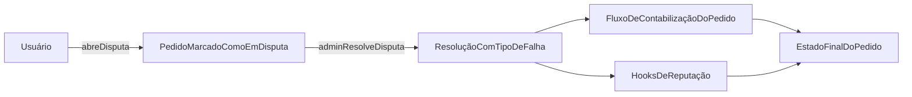

Um usuário abre uma disputa de um pedido se as condições de tempo e estado forem atendidas. O pedido é marcado como em disputa, o estado de disputa do comerciante é atualizado, e um administrador resolve com um tipo de falha (`USER`, `MERCHANT` ou `BANK`). A resolução aciona os fluxos de contabilização do pedido e atualizações de reputação (RP) por meio de hooks.

* As janelas de disputa diferem por tipo de pedido.
* Uma disputa não pode ser aberta duas vezes.
* A resolução requer autorização de um administrador.

*Camadas de escalonamento baseadas em arbitragem (resolvedor T1, árbitro T2, governança por token T3) e escalonamento automático baseado em SLA estão planejados para uma versão futura.*

---

