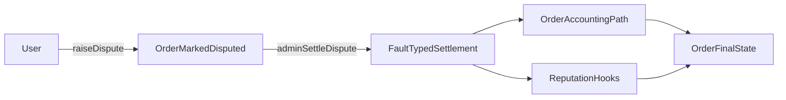

Um usuário abre uma disputa para um pedido quando as condições de tempo e estado do pedido são atendidas. O pedido é marcado como disputado e o estado de disputa do lojista é atualizado. Um titular da capacidade de resolução de disputas do círculo do pedido então resolve a disputa com um tipo de falha (`USER`, `MERCHANT` ou `BANK`). A resolução aciona os caminhos de contabilidade do pedido, e o [RP](/pt/for-builders/reputation) (Pontos de Reputação) é atualizado via hooks.

- As janelas de disputa diferem por tipo de pedido.
- Uma disputa não pode ser aberta duas vezes.
- A resolução requer autorização de administrador.

*Níveis de escalonamento baseados em júri (resolvedor T1, júri T2, governança-token T3) e escalonamento automático baseado em SLA estão planejados para uma versão futura.*

---
