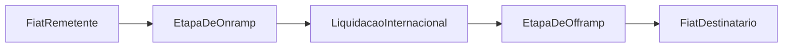

O protocolo já realiza liquidação de fiat para stablecoin e de stablecoin para fiat de forma independente. A remessa encadeia essas duas etapas de forma atômica. O remetente paga em moeda fiduciária no País A, o destinatário recebe em moeda fiduciária no País B, e o salto em stablecoin no meio é invisível para ambos.

Onramp, offramp, disputas e trilhos de matching já existem. A principal ideia é que remessas são puramente um problema de composição construído a partir de primitivas existentes. Não são necessárias novas suposições de confiança.

**O que há de novo para desenvolvedores.**

* Um tipo de ordem vinculada que conecta de forma atômica as etapas de onramp e offramp
* Um contrato de escrow que mantém a stablecoin entre as etapas (falha em um lado reembolsa o outro)
* Um fluxo de resgate para destinatários que ainda não possuem contas
* Exibição de cotações entre moedas e detalhamento transparente das taxas

---