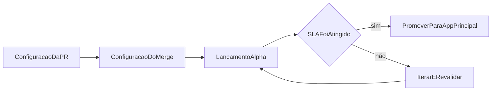

Adicionar um novo país hoje exige coordenação manual, sem um processo padronizado. O conhecimento local fica isolado. O framework de expansão resolve isso ao tornar as configurações de países open-source e os critérios de promoção transparentes.

- Configurações de país em YAML open-source que capturam o conhecimento sobre trilhos de pagamento locais
- Ambiente alpha, onde novas moedas são lançadas com o aviso explícito de “sem garantia de SLA”
- Métricas públicas de saúde (taxa de liquidação, taxa de disputas, volume) que determinam a promoção para o app principal

O gargalo da expansão geográfica é o conhecimento local. Configurações open-source permitem que qualquer pessoa com expertise local proponha uma nova moeda. Critérios públicos de SLA garantem qualidade sem exigir que a equipe central avalie manualmente cada mercado.

---

