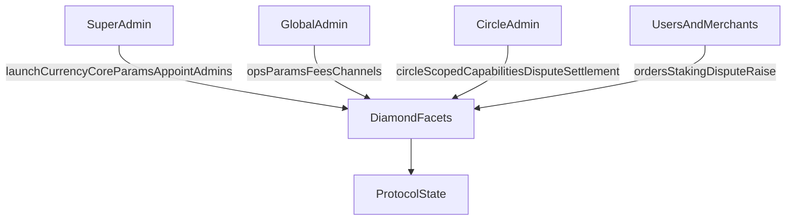

O protocolo utiliza controle de acesso baseado em capacidades (RBAC), aplicado por meio de `CapabilityFacet` e `LibCapability`.

- **Super admin** lança moedas, define parâmetros centrais de risco/limite, gerencia configurações críticas do protocolo e nomeia administradores globais.

- **Global admin** detém permissões em todos os Círculos, cobrindo parâmetros operacionais como spread, percentuais de taxa de comerciante e ações de comerciante/canal de pagamento.

- **Administrador de Círculo** concede e revoga capacidades com escopo de Círculo dentro de seu próprio Círculo (super admins também podem fazê-lo), controlando ações como a resolução de disputas de pedidos naquele Círculo.

- **Comerciantes e usuários** conduzem o ciclo de vida dos pedidos, os fluxos de staking e registro, e a abertura de disputas de acordo com as regras do contrato.

---
