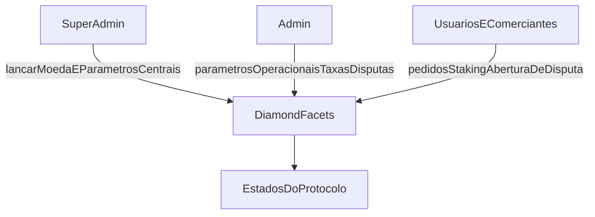

O protocolo define três escopos de governança.

**Superadministrador (Super admin)** lança moedas, define parâmetros centrais de risco/limite e gerencia configurações críticas do protocolo.

**Administrador (Admin)** gerencia parâmetros operacionais, incluindo spread, porcentagens de taxas de comerciantes, disputas e ações relacionadas a comerciantes/canais de pagamento.

**Comerciante e usuário** abrangem o ciclo de vida dos pedidos, fluxos de staking/registro e a abertura de disputas de acordo com as regras do contrato.

---