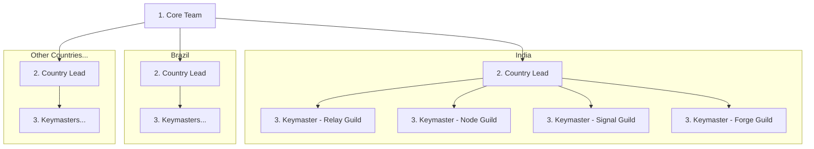

| Nível             | Função                                       | Codinome         |
| ----------------- | -------------------------------------------- | ---------------- |
| Core Team         | Fundadores e líderes do protocolo            | "Core Team"      |
| Country Lead      | Gerencia todas as trilhas em um país         | "Country Lead"   |
| Coordenador       | Coordenadores de trilha                      | "Keymaster"      |
| Colaborador       | Embaixadores da comunidade                   | "Cipher"         |

Cada "Keymaster" gerencia até 5 "Ciphers".

## Responsabilidades do Country Lead

Cada "Country Lead" gerencia as quatro trilhas do seu país.

| Codinome             | Escopo                                                          |
| -------------------- | --------------------------------------------------------------- |
| **Relay Guild**      | Canais de Discord/Telegram do país                              |
| **Node Guild**       | Faculdades e eventos locais                                     |
| **Signal Guild**     | Redes sociais regionais (conteúdo em idioma local)              |
| **Forge Guild**      | Traduções, comunidade local de desenvolvedores                  |

---
