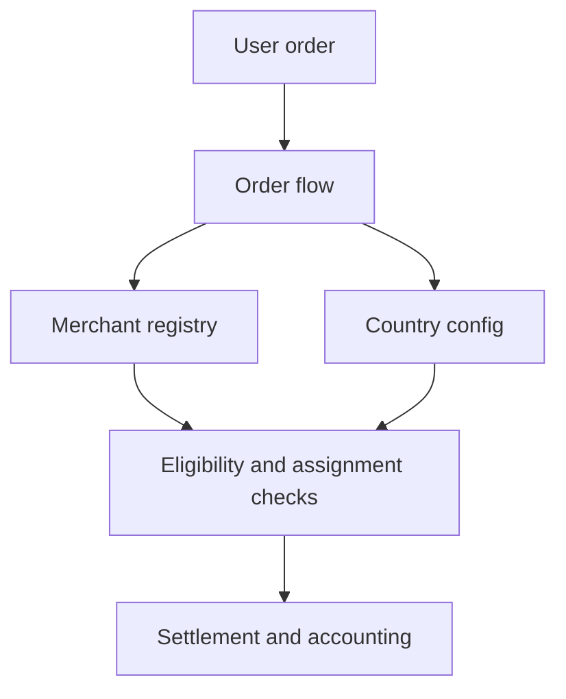

Um Círculo de Confiança é um coletivo de merchants com respaldo comunitário, operado por um Administrador de Círculo. Cada Círculo funciona como uma unidade semi-autônoma dentro do protocolo, gerenciando sua própria rede de merchants enquanto segue as regras compartilhadas do protocolo on-chain.

Os Círculos organizam os merchants em grupos responsáveis, habilitam a supervisão comunitária por meio de staking e delegação, e distribuem o risco por meio de pools de seguro em camadas.

O registro de merchants é o núcleo operacional que os Circles of Trust envolvem. Todas as operações de merchants são on-chain e controladas por funções de acesso.

*Entidades de Círculo de primeira classe com ciclo de vida dedicado, funções de Administrador de Círculo com requisitos explícitos de stake e agrupamento de merchants com escopo de Círculo estão planejados para uma versão futura.*

---
