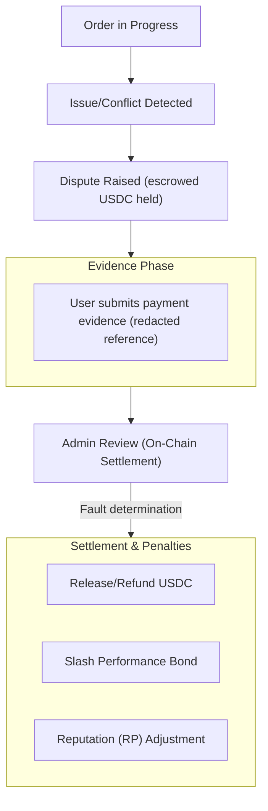

Se uma disputa for aberta, siga estas etapas.

1. Revise o contexto do pedido e os registros de tempo.
2. Envie as evidências de suporte no aplicativo.
3. Acompanhe as atualizações de resolução e as transições de estado resultantes do pedido.

As disputas são resolvidas on-chain pelo Administrador de Círculo do pedido (ou por um detentor de capacidade autorizado para aquele Círculo), que determina a responsabilidade do usuário ou do comerciante. As janelas de disputa definem quando uma disputa pode ser aberta.

As janelas são aplicadas on-chain por tipo de pedido. Para um pedido de compra, o usuário pode abrir uma disputa a partir de 15 minutos após a criação do pedido até 24 horas após a criação. Uma disputa de compra exige adicionalmente que o pedido esteja no estado cancelado com um registro de data e hora de pagamento. Para um pedido de venda ou pagamento, a janela vai de 30 minutos após a criação até 7 dias após a criação. Tentativas fora desses limites são revertidas.

| Tipo de pedido | Prazo mais cedo para abrir disputa | Prazo mais tarde para abrir disputa |
|----------------|-------------------------------------|--------------------------------------|
| Compra | 15 minutos após a criação | 24 horas após a criação |
| Venda ou pagamento | 30 minutos após a criação | 7 dias após a criação |

*Camadas de escalonamento baseadas em júri e finalidade por voto de governança para disputas estão planejadas para uma versão futura.*

---
