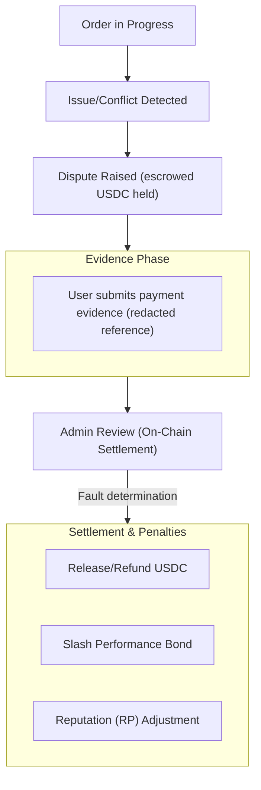

Se uma disputa for aberta, siga estas etapas.

1. Revise o contexto do pedido e os registros de tempo.
2. Envie as evidências de suporte no aplicativo.
3. Acompanhe as atualizações de resolução e as transições de estado resultantes do pedido.

As disputas são resolvidas on-chain pelo Circle Admin do pedido (ou por um detentor de capacidade autorizado para aquele Circle), que determina a responsabilidade do usuário ou do comerciante. As janelas de disputa definem quando uma disputa pode ser aberta.

*Camadas de escalonamento baseadas em júri e finalidade por voto de governança para disputas estão planejadas para uma versão futura.*

---
