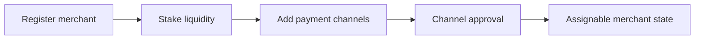

## Passo 1 Registrar e Fazer Staking

1. Registre-se como comerciante para uma moeda ativa.
2. Faça o staking da liquidez de liquidação exigida.
3. Confirme seu perfil de comerciante e status operacional.

## Passo 2 Adicionar Canais de Pagamento

1. Adicione canais de pagamento para os rails suportados.
2. Aguarde os estados de aprovação necessários.
3. Mantenha os canais aprovados ativos e atualizados.

---
