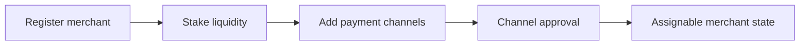

## Passo 1 Registrar e Fazer Staking

1. Registre-se como comerciante para uma moeda ativa.
2. Faça o staking da liquidez de liquidação exigida.
3. Confirme seu perfil de comerciante e status operacional.

## Passo 2 Adicionar Canais de Pagamento

1. Adicione canais de pagamento para os rails suportados.
2. Aguarde os estados de aprovação necessários.
3. Mantenha os canais aprovados ativos e atualizados.

## Capacidade por Pedido e Regras de Conta

Sua capacidade de compra por pedido é derivada dos seus Reputation Points e da moeda em que você opera, não de um múltiplo fixo do seu stake. A relação é definida por moeda. Os valores abaixo são os padrões atuais e o valor vigente é exibido no aplicativo.

| Moeda | Taxa de capacidade | Limite por transação | Limite de volume anual |
|-------|--------------------|----------------------|------------------------|
| INR | 1 RP equivale a $1 USDC | $400 USDC | $20,000 USDC |
| BRL | 1 RP equivale a $2 USDC | $400 USDC | $20,000 USDC |
| IDR | 1 RP equivale a $2 USDC | $400 USDC | $20,000 USDC |
| ARS | 1 RP equivale a $1 USDC | $400 USDC | (definido por moeda) |

Os Reputation Points são acumulados por verificação e por marcos cumulativos de volume em $1,000, $5,000, $20,000 e $50,000 USDC. A quantidade de pedidos também é limitada. Os padrões atuais são 5 pedidos de compra por dia, 25 pedidos de compra por mês e um limite diário de venda equivalente a dez vezes o limite de venda por transação. Os valores vigentes são exibidos no aplicativo.

As regras de conta e de canais de pagamento variam por país e são aplicadas no aplicativo. Opere somente a partir de contas em seu próprio nome. Em alguns mercados, a orientação genérica de "adicionar mais canais de pagamento" não se aplica; siga as instruções específicas para o seu país exibidas no aplicativo.

---
