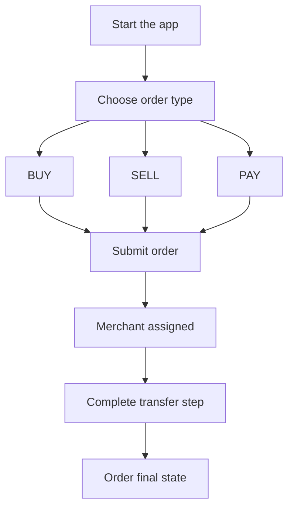

1. Abra o aplicativo e selecione `BUY`, `SELL` ou `PAY`.
2. Informe o valor e os dados do destinatário/pagamento exigidos.
3. Envie o pedido e aguarde a atribuição do comerciante.
4. Siga as instruções do aplicativo para realizar a transferência e confirmar a operação.

---
