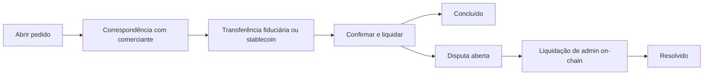

## 3.1 Atores

O protocolo envolve vários participantes-chave trabalhando juntos para habilitar transações peer-to-peer sem necessidade de confiança.

**Compradores e Vendedores** são usuários comuns que iniciam pedidos de on-ramp ou off-ramp. Eles interagem com o protocolo por meio de aplicativos cliente usando carteiras integradas e realizam transações sem abrir mão da custódia dos seus fundos.

**Comerciantes**, também conhecidos como pares de liquidez, atuam como contrapartes que medeiam a liquidez entre stablecoins e moedas fiduciárias. São participantes cuidadosamente verificados que mantêm liquidez suficiente e construíram reputações sólidas por meio do sistema Proof-of-Credibility.

**Contratos de Protocolo** são os contratos inteligentes on-chain que orquestram todo o ciclo de vida do pedido. Eles gerenciam a fila de pedidos, a correspondência baseada em pontuações de credibilidade, a verificação de estado e os resultados finais de liquidação. Estes contratos operam atualmente na Base L2 (expansão multicadeia para Solana está planejada).

**Verificadores de Prova** atualmente validam provas ZK-KYC para verificação de identidade (IDs governamentais, contas sociais e passaportes via Reclaim Protocol e outros verificadores ZK). A verificação de transações bancárias está planejada (veja [Seção 4.2](/pt/whitepaper/cryptographic-primitives-proof-integration#42-evidence-module-for-bank-transaction-verification-roadmap)).

**Governança** está dividida em duas camadas. Os parâmetros do protocolo e as atualizações na Base são governados pelos detentores de $P2P por meio de um Governor on-chain, enquanto a cunhagem de tokens, as mudanças de oferta e a alocação do tesouro são governadas na Solana por meio do mercado de decisão on-chain da MetaDAO. A implementação atual é operada por admin/multisig, com uma transição para uma governança mais ampla dos detentores de tokens em andamento conforme o protocolo amadurece.

## 3.2 Componentes

- **Contratos inteligentes Base L2** (com expansão para Solana) para ciclo de vida do pedido, correspondência, janelas de disputa, registro de parâmetros e roteamento de taxas.
- **Registro de reputação** que implementa o Proof-of-Credibility (entradas, pontuação, penalidades).
- **Adaptador de oráculo** para precificação de referência e salvaguardas (mediana/TWAP, fallbacks, disjuntores).
- **SDKs de cliente** e aplicativos de referência (ex.: Coins.me) que consomem o protocolo.

## 3.3 Fluxo de Alto Nível

1. **Colocando Pedidos:** Um usuário clica em "Comprar USDC" (ou "Vender USDC") e insere o valor. O aplicativo fornece uma carteira integrada para a transação.
2. **Correspondência de Pedidos:** Um comerciante é atribuído on-chain com base em USDC apostado. Um endereço de pagamento fiduciário é compartilhado pelo contrato inteligente, criptografado com as chaves do usuário. Para off-ramps, é apresentado um endereço USDC na Base (com expansão para Solana).
3. **Transferência Fiduciária/Stablecoin:** O pagador realiza a transferência no canal designado.
4. **Confirmação/Liquidação:** Em minutos, a liquidação é concluída assim que o comerciante confirma o recebimento. Os saldos das carteiras são atualizados de acordo.
5. **Janela de Disputa:** Se uma parte contesta, ela submete evidências de que um pagamento ou ação ocorreu (ou não ocorreu). Na implementação em produção, admins autorizados liquidam pedidos disputados on-chain de acordo com as regras de responsabilidade do protocolo e as janelas de disputa.



## 3.4 Fluxo de On-Ramp

```
┌─────────────────────────────────────────────────────────────────────────┐
│                    FLUXO DE ON-RAMP (Fiduciário → USDC)                 │
├─────────────────────────────────────────────────────────────────────────┤
│                                                                         │
│   ┌──────────┐         ┌──────────────┐         ┌──────────────┐        │
│   │ USUÁRIO  │         │   PROTOCOLO  │         │ COMERCIANTE  │        │
│   └────┬─────┘         └──────┬───────┘         └──────┬───────┘        │
│        │                      │                        │                │
│        │  1. Abrir pedido BUY │                        │                │
│        │  (valor + canal)     │                        │                │
│        │─────────────────────►│                        │                │
│        │                      │                        │                │
│        │                      │  2. Corresponder via   │                │
│        │                      │  PoC (pontuação de    │                │
│        │                      │  credibilidade)       │                │
│        │                      │───────────────────────►│                │
│        │                      │                        │                │
│        │  3. Receber endereço │                        │                │
│        │  de pagamento        │                        │                │
│        │  fiduciário          │                        │                │
│        │◄─────────────────────│                        │                │
│        │  (criptografado)     │                        │                │
│        │                      │                        │                │
│        │  4. Transferir       │                        │                │
│        │  fiduciário via      │                        │                │
│        │  UPI/PIX/SPEI        │                        │                │
│        │──────────────────────────────────────────────►│                │
│        │                      │                        │                │
│        │                      │  5. Comerciante       │                │
│        │                      │  confirma recebimento │                │
│        │                      │◄───────────────────────│                │
│        │                      │                        │                │
│        │  6. USDC liberado    │                        │                │
│        │  para carteira do    │                        │                │
│        │  usuário             │                        │                │
│        │◄─────────────────────│                        │                │
│        │                      │                        │                │
│   ┌────▼─────┐         ┌──────▼───────┐         ┌──────▼───────┐        │
│   │  USDC    │         │    TAXAS     │         │   TÍTULOS    │        │
│   │ RECEBIDO │         │  COLETADAS   │         │  DESBLOQUEADOS│        │
│   └──────────┘         └──────────────┘         └──────────────┘        │
│                                                                         │
└─────────────────────────────────────────────────────────────────────────┘
```

## 3.5 Fluxo de Off-Ramp

```
┌─────────────────────────────────────────────────────────────────────────┐
│                    FLUXO DE OFF-RAMP (USDC → Fiduciário)                │
├─────────────────────────────────────────────────────────────────────────┤
│                                                                         │
│   ┌──────────┐         ┌──────────────┐         ┌──────────────┐        │
│   │ USUÁRIO  │         │   PROTOCOLO  │         │ COMERCIANTE  │        │
│   └────┬─────┘         └──────┬───────┘         └──────┬───────┘        │
│        │                      │                        │                │
│        │  1. Abrir pedido     │                        │                │
│        │  SELL + bloquear     │                        │                │
│        │  USDC                │                        │                │
│        │─────────────────────►│                        │                │
│        │                      │                        │                │
│        │                      │  2. Corresponder via   │                │
│        │                      │  PoC + comerciante     │                │
│        │                      │  posta título          │                │
│        │                      │───────────────────────►│                │
│        │                      │                        │                │
│        │  3. Compartilhar     │                        │                │
│        │  endereço fiduciário │                        │                │
│        │  de recebimento      │                        │                │
│        │─────────────────────►│                        │                │
│        │  (criptografado)     │                        │                │
│        │                      │                        │                │
│        │                      │  4. Comerciante       │                │
│        │                      │  envia pagamento      │                │
│        │  Fiduciário recebido │  fiduciário           │                │
│        │◄──────────────────────────────────────────────│                │
│        │                      │                        │                │
│        │                      │  5. Comerciante       │                │
│        │                      │  submete confirmação  │                │
│        │                      │  de pagamento         │                │
│        │                      │◄───────────────────────│                │
│        │                      │                        │                │
│        │                      │  6. USDC liberado     │                │
│        │                      │  para comerciante     │                │
│        │                      │───────────────────────►│                │
│        │                      │                        │                │
│   ┌────▼─────┐         ┌──────▼───────┐         ┌──────▼───────┐        │
│   │ FIDUCIÁRIO│        │    TAXAS     │         │    USDC      │        │
│   │ RECEBIDO │         │  COLETADAS   │         │  RECEBIDO    │        │
│   └──────────┘         └──────────────┘         └──────────────┘        │
│                                                                         │
└─────────────────────────────────────────────────────────────────────────┘
```

## 3.6 Considerações Principais

- O **comerciante** desempenha a função de mediar a liquidez nas transações.
- O **ônus de confirmar o pagamento** recai sobre o comerciante (para off-ramps) ou pode ser fornecido por qualquer uma das partes.
- **ZK-KYC realiza verificação de identidade sem necessidade de confiança** para o usuário sem expor dados pessoais.
- **Evidências são submetidas e revisadas** em disputas. No sistema atual, os resultados são executados por meio de liquidação de admin on-chain. Uma resolução mais ampla conduzida por verificadores e governança permanece no roadmap (veja [Seção 4.2](/pt/whitepaper/cryptographic-primitives-proof-integration#42-evidence-module-for-bank-transaction-verification-roadmap)).
- O **Reclaim Protocol** habilita a verificação de contas sociais com preservação de privacidade via zkTLS. O Aadhaar é verificado por meio do Anon Aadhaar e passaporte ou documento de identidade nacional por meio do ZKPassport.

---
